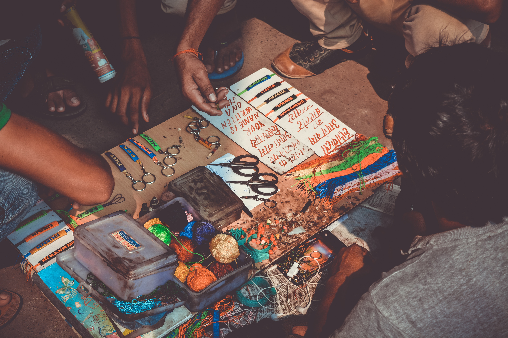

# Communications

ICT4D is founded upon the idea that communications which are faster, less costly, and more convenient can have a significant impact on social and economic growth.

Communications include formal and informal messaging, feedback channels on a range of projects and processes, and broadcasting ideas through a variety of channels.

The growth of mobile communications in both technology and demonstrated by user preferences around the world puts significant focus on the use of mobile tools of communication for social growth—which bring with them new questions of user experience, sustainability, and privacy.

## Ideas

- Amplifying the reach of your projects to more people and communities. 
- Faster and more reliable feedback loops through reminders and follow-up. 
- Simple and low-cost way to exchange ideas, updates, questions. 

## Resources

### Readings

- [How social media data can improve people’s lives - if used responsibly - The Conversation](https://theconversation.com/how-social-media-data-can-improve-peoples-lives-if-used-responsibly-75367) -- Overview of social media data use in international development contexts. (Reading > communications > social media, data responsibility)
- [How to Integrate Mobile Solutions into Development Projects - USAID](http://donorscharter.org/resources/USAID-Mobile-Development-Handbook.pdf) -- Toolkit for development practitioners using mobile communications. (Reading > communications > mobile, manual)

### Services

- [appear.in](https://appear.in/) -- Browser-based video conferencing. (Service > communications > video conferencing)
- [BlueJeans Conferencing](https://www.bluejeans.com/) -- Video-conferencing and screen-sharing. Works well when facing faulty connections. (Service > communications > video conferencing)
- [Buffer](https://buffer.com/) -- Share in intervals with social media. (Service > communications > social media)
- [CardBoard](https://cardboardit.com/) -- Story mapping and shared card analysis. (Service > communications > collaboration, story maps)
- [Formcarry](https://formcarry.com/) -- Forms for designers and developers. (Service > communications > feedback, forms)
- [Formsite.com](https://www.formsite.com/) -- Extensible forms for programmer-types. (Service > communications > feedback, forms)
- [Frame.io](http://frame.io/) -- Share and review media with your team. (Service > communications > feedback, collaboration)
- [FrontlineSMS](https://frontlinesms.com/) -- SMS management tools. (Service > communications > sms, mobile data collection)
- [Invision](http://www.invisionapp.com/) -- Prototyping, collaboration & workflow platform. (Service > communications > collaboration, prototyping)
- [Nexmo](https://nexmo.com/) -- APIs for SMS, voice & phone verification. (Service > communications > sms, mobile data collection)
- [RapidSMS](http://rapidsms.org/) -- Framework for rapidly building mobile services for scale. (Service > communications > sms, mobile data collection)
- [RealtimeBoard](https://realtimeboard.com/) -- Online whiteboard & online collaboration tool. (Service > communications > collaboration, whiteboard, collaboration)
- [Red Pen](https://redpen.io/) -- Fast deliverable feedback. (Service > communications > feedback, review)
- [Sociograph.io](https://sociograph.io/report.html) -- Statistical analysis of your Facebook groups. (Service > communications > social media, analytics)
- [TextIt](https://textit.in/) -- Visually build SMS and voice apps. (Service > communications > sms, mobile data collection)
- [Thunderclap](https://www.thunderclap.it/) -- Create a social media coordinated campaign. (Service > communications > social media, twitter)
- [Twilio](https://twilio.com/) -- APIs for text messaging. (Service > communications > sms, mobile data collection)
- [Voto Mobile](https://votomobile.org/) -- Mobile phone notification and survey tool -- also uses voice recordings and IVR. (Service > communications > sms, mobile data collection)
- [VSee Messenger](https://vsee.com/) -- Low-bandwidth video conferencing. (Service > communications > video conferencing)
- [WriteRack](https://writerack.com/app) -- Create a tweetstorm. (Service > communications > social media, tweetstorm)
- [Your Social Media Fingerprint](https://robinlinus.github.io/socialmedia-leak/) -- Detect which platforms you're currently signed into. (Service > communications > social media)

### Organizations

- [Ushahidi](http://ushahidi.com) -- Global non-profit technology company that changes the way information flows in the world and empower people to make an impact with open source technologies, cross-sector partnerships, and ground-breaking ventures. (Organization > communications > international development, data)
- [VillageTelco](https://villagetelco.org) -- Non-profit that builds low-cost community telephone network hardware and software. (Organization > communications > appropriate technology)# Computer Lab

Computer labs offer flexible environments for education, digital literacy, and engaging with technology in a variety of ways.

Computer labs have a long history in ICT4D and exist in range of setups: school computer labs, telecenters, Internet cafes, and public libraries.

Field staff find themselves still front-and-center in helping to create, facilitate, and encourage atmospheres of technical instruction in a safe, open, and impactful ways.

## Ideas

- School computer labs to supplement coursework in all school subjects.
- Teach computer programming to all ages.
- Practice digital literacy skills and digital responsibility.

## Resources

### Services

- [Acceptable Use Policies - Education World](http://educationworld.com/a_curr/curr093.shtml) -- Examples and tips for creating your own AUP with your local school, cyber cafe, or community center. (Service > computer lab > policies, resources)
- [Libib](https://libib.com/) -- Cataloging software for books, movies, music & video games online. (Service > computer lab > library)
- [Responsible & Acceptable Use Guidelines - US Digital Literacy](http://digitalliteracy.us/responsible-acceptable-use-guidelines/) -- Creating an 'Acceptable Use Policy'. (Service > computer lab > policies, resources)
- [Sample Acceptable Use Policies - Webwise](https://webwise.ie/teachers/sample-acceptable-use-policies-2/) -- Sample 'acceptable use policies'. (Service > computer lab > policies, resources)

### Software

- [Evergreen ILS](https://evergreen-ils.org/) -- Software used by libraries to provide their public catalog interface as well as to manage back-of-house operations such as circulation (checkouts and check-ins), acquisition of library materials, and sharing resources among groups of libraries. (Software > computer lab > library, software)
- [Koha Library Software](https://koha-community.org/) -- Scalable library management system. (Software > computer lab > library, software)

### Organizations

- [Interconnection.org](http://interconnection.org) -- International organization that makes ICT accessible to underserved communities around the world by providing high-quality refurbished computers to nonprofit and non-governmental organizations. (Organization > computer lab)
- [Kids On Computers](http://www.kidsoncomputers.org/) -- Nonprofit organization comprised of a group of volunteers, setting up computer labs in areas where kids don’t have access to technology. (Organization > computer lab > children)
- [World Computer Exchange](http://worldcomputerexchange.org) -- Non-profit organization that provides capacity building, low-cost computers, content development, training trips, computers for girls and local e-waste solutions. (Organization > computer lab > funding)# Computer Programming

Learning how to code and program computers can benefit students and communities in a number of ways beyond simple exposure to coding.

Programming teaches how to problem-solve, think critically and analytically, ask questions, work in teams, and maybe most important of all, how to be creative and have fun with technology!

Schools are increasingly promoting computer programming and coding in official curricula–and there are lots of ways to incorporate programming in many different education topics.

There are resources and platforms to learn coding at all levels, for all ages, from immersively interactive to offline textbooks.

## Ideas

- ‘Hour of Code’ activities to promote computer programming.
- Computer programming as a way to coordinate and focus youth and entrepreneurship camps and clubs.

## Resources

### Readings

- [This Computer Language Is Feeding Hacker Values into Young Minds](https://backchannel.com/the-kids-computer-language-that-became-a-mind-bomb-for-the-hacker-ethic-a0b7e42c229d) -- Exploration of computer programming as a means to promote tinkering and hacking. (Reading > programming > children, hacking)

### Videos

- [Live EDU](https://www.liveedu.tv/livestreams) -- Videos of real-time coding. (Video > programming > learn)
- [What is Coding? - YouTube](https://youtube.com/watch?v=cKhVupvyhKk) -- Great overview from 'Hour of Code' project to introduce the idea of coding. (Video > programming > introduction)

### Websites

- [Amazon Web Services - A Practical Guide](https://github.com/open-guides/og-aws) -- Github open guide to AWS. (Website > programming > course, manual, aws)
- [Android Developers](https://developer.android.com/training/) -- Android development from Google. (Website > programming > course, android)
- [Beetle Blocks](http://beetleblocks.com/) -- Visual code for 3d design. (Website > programming > 3d, design)
- [Bento](https://bento.io/) -- Learn to code and be a self-taught expert programmer. (Website > programming > course, youth)
- [Blockly](https://blockly-games.appspot.com/) -- Game-based programming. (Website > programming > course, games, youth)
- [Code Avengers](https://codeavengers.com/) -- A number of courses which include CSS3, JavaScript, and HTML5. (Website > programming > course, css, html, javascript, youth)
- [Code Combat](https://codecombat.com/) -- Learn coding by playing a game. (Website > programming > course, games)
- [Code Guide](http://codeguide.co/) -- Standards for developing flexible, durable, and sustainable HTML and CSS. (Website > programming > reference, html, css)
- [Code school](https://codeschool.com/) -- For the more advanced students. Includes iOS, HTML/CSS, JavaScript and Ruby. (Website > programming > course, advanced, ios, html, css, ruby, javascript)
- [Code.org](https://code.org/) -- Tons of online courses, challenges built around the Hour of Code (with awesome modules like [Minecraft](https://code.org/mc), [Angry Birds](http://learn.code.org/hoc/1), [Star Wars](https://code.org/starwars), Disney's [Frozen](https://studio.code.org/s/frozen/stage/1/puzzle/1), introductory curricula in computer science, fundamentals of code taught in their [Code Studio](https://studio.code.org/), and available in 40+ languages. (Website > programming > course)
- [Codecademy](https://www.codecademy.com/) -- Interactive code lessons. (Website > programming > course)
- [CodeHS](https://codehs.com/) -- comprehensive teaching platform for helping schools teach computer science. (Website > programming > course, youth)
- [CodeHS](https://code.org/learn/codehs) -- Demos of types of programs; kids are actually typing the code; uses Ruby, not Java; only 4 simple directions, but might be challenging for some students; not sure about iPad usage, but works well on laptops; class setup is needed prior to student use. (Website > programming > course, youth)
- [Computer Science Education - Google](https://www.google.com/edu/cs/learn.html) -- Google's paths of learning for students and educators. (Website > programming > course, computer science, youth)
- [Computer Science Unplugged](http://csunplugged.org/) -- Collection of free learning activities that teach Computer Science through engaging games and puzzles that use cards, string, crayons and lots of running around. (Website > programming > course, offline, youth)
- [Crunchzilla](http://crunchzilla.com/) -- Interactive tutorials where kids and adults can play with code, experiment, build, and learn. Data Maven is an introductory statistics tutorial designed to spark a curiosity for statistics and data.  (Website > programming > course, data)
- [CS First - Google](http://cs-first.com/) -- Free curriculum from Google that uses online, project-based tutorials for elementary and middle school students and offers free club plans and resources to create an easy computer science entry point for educators and students alike. (Website > programming > course, youth)
- [Development Documents](http://devdocs.io/) -- Development docs reference links. (Website > programming > reference)
- [Edhesive](https://edhesive.com/) -- Year-long AP Computer Science course. (Website > programming > course, computer science)
- [Free Programming Books - VHF](https://github.com/vhf/free-programming-books) -- Freely available programming books from a Github repository. (Website > programming > course, book)
- [Hour of Code](https://code.org/learn) -- Yearly global activity to teach coding at all levels for one hour. (Website > programming > activity, youth)
- [Intermediate Web Literacy - Mozilla](https://teach.mozilla.org/activities/intermediate-web-lit/) -- Learn to style HTML elements on a webpage using CSS selectors, attributes, and values. (Website > programming > course, lesson)
- [iPhone Development Tutorials - Raywenderlich](http://www.raywenderlich.com/) -- iPhone development tutorials. (Website > programming > course, ios)
- [Learn X in Y Minutes](https://learnxinyminutes.com/) -- Whirlwind community-driven tour of the most common computer programming languages. (Website > programming > course)
- [Made with Code - Mozilla](https://teach.mozilla.org/activities/madewithcode) -- Mozilla and Google partnership to inspire girls to get creative with code. (Website > programming > girls, youth)
- [Make School](https://www.makeschool.com/) -- Build and ship digital products school. (Website > programming > project management)
- [NETTUS](https://code.tutsplus.com/) -- Free tutorials in code, web design, and web development. (Website > programming > course, web design, web development)
- [Pencil Code](https://pencilcode.net/) -- Real web real developing skills -- starting with turtle graphics and moving on to HTML5, CSS, and jQuery. Create art, music, games, and stories in Coffeescript and JavaScript using a unique switchable editor that lets you work in either blocks or text. (Website > programming > course, html, css)
- [RoboMind Academy](https://robomindacademy.com/) -- Program to control a virtual robot to move, pick up, paint, etc. using text instructions. (Website > programming > course, youth)
- [Scratch](https://scratch.mit.edu/) -- Program your own interactive stories, games, and animations -- and share your creations with others in the online community. (Website > programming > course, youth)
- [Technovation Curriculum](https://technovationchallenge.org/curriculum) -- Finally, and just in time for the 2016 season, Technovation has updated their curriculum. The units have new videos, additional activities and resources. These materials are intended to help you dive deeper into the concepts covered in the curriculum. (Website > programming > lessons, girls)
- [TechPrep - Facebook](https://techprep.fb.com/) -- Great [introduction to the value of computer education to girls](https://techprep.fb.com/why/) and resources to get started if you're a [student](https://techprep.fb.com/get-started/) or [mentor](https://techprep.fb.com/get-started/). (Website > programming > course)
- [The Beauty and Joy of Computing - An AP CS Principles course](http://bjc.berkeley.edu/) -- Year-long CS Principles course. (Website > programming > course, computer science)
- [Thimble - Mozilla](https://thimble.mozilla.org/en-US/) -- This is an online code editor for learners & educators. It walks you through publishing your own web pages while learning HTML, CSS & JavaScript. It's part of the [Made with Code](https://www.madewithcode.com/) effort (another great site). (Website > programming > activity, code environment)
- [Treehouse](https://teamtreehouse.com/) -- Learn development and design online. (Website > programming > course, development, design)
- [Tynker](https://tynker.com/) -- Drag-and-drop coding that eliminates syntax, with option to show the code as text, [school info](http://www.tynker.com/school/) and a [video](http://youtu.be/zK_EWkzmw64); good for K-8; getting started videos to help teachers create a classroom, add students, choose a lesson plan; tutorials and gallery contain ready-to-use projects and lessons; [info about coding for 2nd-7th graders](http://www.tynker.com/blog/articles/teacher-profiles/early-cs-education-in-grades-2-7/). (Website > programming > course)
- [W3Schools](https://w3schools.com/) -- Users can educate themselves on everything from HTML and CSS to JavaScript and SQL in web development. (Website > programming > course, reference)
- [Web Development Tools - UI Test](https://uitest.com/en/analysis/) -- Rollup of general, analysis, SEO and SEM, validation, accessibility, network and security, performance. (Website > programming > reference, test)
- [Web Fundamentals](https://developers.google.com/web/fundamentals/) -- Google web fundamentals guide. (Website > programming > course, reference)

### Services

- [Building for Billions - Google](https://developers.google.com/web/billions/) -- Google portal for resources and information about building platforms for the less-connected parts of the world. (Service > programming > reference, library)
- [CodePen](http://codepen.io/) -- Front-end developer playground & code editor in the browser. (Service > programming > html, css, javascript, code environment)
- [Coolors](https://coolors.co/) -- Generate infinite color palettes for your designs and share, export or save it in your profile. (Service > programming > color, design)
- [Dirty Markup](http://www.dirtymarkup.com/) -- Tidy up your HTML, CSS, and JavaScript code. (Service > programming > html, css, javascript)
- [Github](https://github.com/) -- Share code with friends, co-workers, classmates, and complete strangers. (Service > programming > repository)
- [Glitch](https://glitch.com/) -- Working example apps to remix, a code editor to modify them, instant hosting and deployment. (Service > programming > course, tutorial)
- [JSFiddle](http://jsfiddle.net/) -- Test code snippets of HTML, JavaScript, and CSS in-browser. (Service > programming > javascript, html, css)
- [Scripting Language Cheatsheets](http://hyperpolyglot.org/scripting) -- Side-by-side reference sheet for scripting languages. (Service > programming > reference)
- [Unpack minified](http://unminify.com/) -- Online tool to un-minify (unpack, de-obfuscate) JavaScript, CSS and HTML code. (Service > programming > javascript, html, css)

### Organization

- [Code for Progress](http://www.codeforprogress.org/) -- Code for Progress brings women and people of color into the coding workforce through holistic investment in their technical training and communities of support. (Organization > programming > women, people of color, entrepreneurship)
- [Code Your Future](https://codeyourfuture.co/) -- Non-profit organisation supporting refugees becoming developers. (Organization > programming > refugees)
- [Code.org](http://code.org) -- Non-profit dedicated to expanding participation in computer science by making it available in more schools, and increasing participation by women and underrepresented students of color. (Organization > programming > entrepreneurship)
- [General Assembly](http://generalassemb.ly) -- Learn technology, design, and business skills from industry professionals in a global community. (Organization > programming > course)
- [Google RISE Awards](https://www.google.com/edu/resources/programs/google-rise-awards/) -- Supports organizations around the world that inspire girls and underrepresented minorities with the power of Computer Science. (Organization > programming > funding)
- [Made with Code - Google.org](http://madewithcode.com) -- Google initiative to champion creativity, girls, and code, all at once. (Organization > programming > entrepreneurship)
- [YesWeCode](http://www.yeswecode.org/) -- Grassroots training programs and teaming up with major technology partners, celebrities and political leaders to promote the goal of training 100,000 low-opportunity youth to become high-level computer programmers. (Organization > programming > youth, entrepreneur)

# Data Responsibility

Protecting oneself from computer viruses and malware is just the beginning when it comes to data responsibility. As practitioners, we must address issues related to individual privacy, data collection, and appropriate processes and communications with informed consent.

Field staff want to make sure that they’re assessing and mitigating any risks to the security of users and their data, considering the context and needs for privacy of personally identifiable information (PII) when using systems, signing users up for platforms, and designing solutions.

Many organizations and technology providers are unaware of the ethical implications of collecting data via new tools and channels, or the nature of the privacy and protection risks that come along with new technologies.

This results in security, privacy and confidentiality not being adequately addressed across the board—and thus a greater importance in addressing data responsibility.

## Ideas

- Practice responsible use of data collection and informed consent in organizations.
- Teach responsible use of digital media platforms for youth — focused on cyberbullying, appropriate images, and scams.

## Resources

### Readings

- [Safeguarding Policy: Digital Privacy, Security, Safety Principles & Guidelines - Girl Effect](www.girleffect.org/media/3052/gem-girl-safeguarding-policys_19-05-16.pdf) -- Manual to help practitioners think through privacy, security, safety of digital information. (Reading > data responsibility > manual, gender, privacy, children)

### Websites

- [#Up2Us Anti-Bullying Kit](https://webwise.ie/2014/teachers/get-the-sid2014-anti-bullying-kit-3/) -- Activities for addressing bullying and the #Up2Us Anti-Bullying Teachers' Handbook with lesson ideas. (Website > data responsibility > manual, child protection, cyberbullying, lessons, children)
- [BeInternetAwesome](https://beinternetawesome.withgoogle.com/) -- Helping kids be safe, confident explorers of the online world. (Website > data responsibility > cyberbullying, safe internet, children)
- [Child Online Protection - digitalliteracy.gov](https://digitalliteracy.gov/taxonomy/term/93) -- Links to resources and sites related to being responsible and making informed decisions online. (Website > data responsibility > safe internet, children)
- [Comic Strips SeguraNet - SeguraNet](http://seguranet.pt/en/comic-strips-seguranet) -- Comic strips targeted at a younger audience to convey Internet safety issues. (Website > data responsibility > safe internet, children)
- [Ethics Resources - ictdethics](https://ictdethics.wordpress.com/other-ethics-frameworks/) -- Frameworks and guidelines that discuss ethics in research areas that are related to ICTD. (Website > data responsibility > ethics)
- [Frontline SMS’ User Guide to Data Integrity](https://drive.google.com/file/d/0B0Vr8VHoYeB7YzExT3otZ04weVk/view) -- Help users to understand, analyze, and address the vulnerabilities, risks and threats that can affect the integrity of SMS communications. (Website > data responsibility > data integrity)
- [INHOPE Mobile phone reporting app](https://inhope.org/tns/resources/INHOPE_mobile.aspx) -- Mobile tool to engage public's participation in reporting of child sexual abuse material found on the Internet. (Website > data responsibility > child protection, sexual abuse, reporting)
- [INSAFE](https://www.betterinternetforkids.eu/) -- Core service platform to create a better internet for children and young people. (Website > data responsibility > safe internet, children)
- [Lockers](https://webwise.ie/lockers/) -- Resource that assists schools in coping with and preventing the sharing of explicit self-generated images of minors. (Website > data responsibility > child protection, safe internet, sexual abuse)
- [Personal Data and Privacy Working Group](https://personal-data.okfn.org/) -- Great list of links and resources related to data privacy. (Website > data responsibility > data privacy, data integrity)
- [Protection of personal data - European Commission](http://ec.europa.eu/justice/data-protection/) -- EU data protection framework. (Website > data responsibility > data privacy, data integrity)
- [Responsible data management - Oxfam Policy & Practice](https://policy-practice.oxfam.org.uk/our-approach/toolkits-and-guidelines/responsible-data-management) -- Resources for responsible data management. (Website > data responsibility > data privacy, data integrity, digital protection)
- [Responsible Data Reflection Stories - Responsible Data Forum](http://responsibledata.io/reflection-stories/) -- Case studies for relevant data responsibility incidents. (Website > data responsibility > data privacy, data integrity, digital protection, case studies)
- [Safer Internet Day](http://saferinternetday.org/) -- Safer Internet Day (SID) is celebrated around the world in February of each year, with Safer Internet Centres, SID Committees and other supporters in each of the countries coming together to plan and organize events. (Website > data responsibility > safe internet)
- [Security in-a-Box](https://securityinabox.org/) -- Blog and guide to digital security for activists and human rights fieldworkers, from the [Tactical Technology Collective](https://tacticaltech.org/). (Website > data responsibility > digital security)
- [Shooting our hard drive into space and other ways to practice responsible development data](https://drive.google.com/file/d/0B0Vr8VHoYeB7cEk1STFlRTJjOWM/edit) -- Book about data responsibility -- literally the best thing on this topic right now. (Website > data responsibility > data privacy, data integrity, digital protection)
- [TechChange course, Basics of Digital Safety](https://techchange.org/online-courses/basics-of-digital-safety/) -- Course on digital safety and responsibility from the wonderful folks at [TechChange](https://techchange.org). (Website > data responsibility > data privacy, data integrity, digital protection)
- [That One Privacy Site](https://thatoneprivacysite.net/) -- Resource for digital privacy on the Internet. (Website > data responsibility > data privacy, digital protection)
- [Webwise - Internet Safety](https://webwise.ie/) -- The Irish Internet Safety campaign -- contains links to great resources and materials. (Website > data responsibility > safe internet)
- [Welcome to DigitalIMPACT.io - digitalIMPACT.io](https://digitalimpact.io/) -- Runner up for the best data responsibility toolkit on the market. Great for non-profits and policymakers. (Website > data responsibility > data privacy, data integrity, digital protection)
- [Community Insights on Principle 8: Address Privacy and Security](http://digitalprinciples.org/community-insights-on-principle-8-address-privacy-and-security/) -- From the Digital Principles. (Website > data responsibility > principles, privacy)
- [Mozilla Advocacy - Mozilla](https://advocacy.mozilla.org/encrypt/social/3) -- Mozilla Foundation spotlight on encryption, journalism, and free expression. (Website > data responsibility > encryption, journalism, privacy)
- [OnGuard Online](https://onguardonline.gov/) -- Government website that teaches users how to be safe, secure, and responsible online. (Website > data responsibility > tools, guide, privacy)
- [Privacy Basics: Online Tracking](https://d157rqmxrxj6ey.cloudfront.net/mozstacy/21938/) -- Learners will complete a set of hands-on activities to better understand types of online tracking through the use of cookies and other technologies. (Website > data responsibility > introduction, youth, privacy)
- [Privacy Basics: Passwords, Tracking, And Data Retention](https://teach.mozilla.org/activities/privacy-basics/) -- Learn how to safeguard your privacy online and develop an awareness of how companies and governments track and collect your data online. (Website > data responsibility > introduction, course, privacy)
- [Privacy Basics: Protect Your Data](https://teach.mozilla.org/activities/protect-your-data/) -- These six hands-on activities engage learners in thinking critically about online privacy by creating secure passwords, understanding how and where their data is being collected, and more. (Website > data responsibility > introduction, course, privacy)
- [Responsible Data Hackpad](https://paper.dropbox.com/doc/Responsible-Data-Hackpad-SA6kouQ4PL3SOVa8GnMEY) -- Hackpad (now DropBox Paper) from a MERLTech Conference breakout on the topic of Data Responsibility. Great links to resources and organizations. (Website > data responsibility > network, library)
- [Resources - Responsible Data Forum](http://responsibledata.io/category/resources/) -- useful tools and strategies for dealing with the ethical, security and privacy challenges facing data-driven advocacy. (Website > data responsibility > responsible data, privacy)
- [Think B4U Click](https://webwise.ie/2014/teachers/thinkb4uclick-2/) -- Designed for teachers, explores the issue of online privacy in the context of online rights and responsibilities. (Website > data responsibility > lessons, youth, privacy)
- [Web We Want](https://webwise.ie/2014/teachers/web-we-want-2/) -- Educational handbook for use by 13-16 year olds, developed with and by young people. Learn more about your online rights and create tips that you can share with young people all over the world. (Website > data responsibility > lessons, youth, privacy)
- [Webwise Primary Teachers' Handbook](https://webwise.ie/2014/teachers/webwiseprimaryprogramme/) -- For primary school teachers who wish to introduce internet safety. The resources teach kids the skills needed for surfing the web. It also examines ways of communicating effectively. (Website > data responsibility > lessons, youth, privacy)

### Software

- [Boxcryptor](https://www.boxcryptor.com/) -- Encryption software to secure cloud files. (Software > digital responsibility > encryption)
- [CaseBox](https://casebox.org) -- Sophisticated case management solution to NGOs with flexible task, document and record management system. (Software > data responsibility > activism, data protection)
- [Digital First Aid Kit](https://www.digitaldefenders.org/digitalfirstaid/) -- Tools for human rights defenders, bloggers, activists and journalists facing attacks themselves, as well as providing guidelines for digital first responders to assist a person under threat. (Software > data responsibility > activism, data protection)
- [Martus](https://martus.org) -- Encrypted digital platform aimed at humanitarian workers and organizations. (Software > data responsibility > activism, data protection)
- [OpenEvsys](https://openevsys.org) -- Open Events System, is a free and open source database application developed by [HURIDOCS](http://www.huridocs.org/), built on the [Events methodology](http://openevsys.wpengine.com/the-methodology-of-openevsys) for recording violations and the “who did what to whom” data model. (Software > data responsibility > activism, data protection)
- [RightsCase](https://equalit.ie/portfolio/rightscase/) -- Securely record, collate and analyae information and evidence of past and ongoing human rights violations. RightsCase allows you to access meaningful statistics through visualisations of collated data. (Software > data responsibility > activism, data protection)
- [Umbrella](https://secfirst.org/) -- Digital and physical security app for people at risk. (Software > data responsibility > activism, data protection)

### Organizations

- [Advocacy Assembly](https://advocacyassembly.org/) -- Non-profit focused on digital privacy and human rights. (Organization > data responsibility > human rights, advocacy, privacy)
- [eNACSO](http://enacso.eu/) -- NGO alliance aimed at creating a safer online environment for children through advocacy actions at national, European Union, and international levels. (Organization > data responsibility > safe internet, children)
- [End Child Pornography and Trafficking (ECPAT)](https://ecpat.org/) -- Protecting children from abduction, sexual abuse and exploitation, and listing of people, resources and tools needed to solve those problems. (Organization > data responsibility > safe internet, children, child protection, sexual abuse)
- [Family Online Safety Institute (FOSI)](http://fosi.org/) -- International, nonprofit organization which works to make the online world safer for kids and their families. (Organization > data responsibility > safe internet, children)
- [International Center for Missing and Exploited children](http://icmec.org/) -- Global network dedicated to protecting children. They coordinate research, advocacy and action to end the commercial sexual exploitation of children. (Organization > data responsibility > child protection, sexual abuse, reporting)
- [Responsible Data Forum](http://responsibledata.io/) -- Resources on digital protection, privacy. (Organization > data responsibility > data privacy, data integrity, digital protection)

# Data

Data is the unsung hero of ICT4D projects and activities. Understanding how data is created, stored, retrieved, manipulated, analyzed, and interpreted are key to any ICT4D fieldwork.

‘Data’ as a thing can also be very difficult to address within ICT4D projects. Data quality, quantity, visualization, mining, storage, and processing all require different approaches and skill sets.

Knowing where to begin with data will help to ensure smooth ICT4D projects.

## Ideas

- Clean and organize a counterpart organizations’ datasets.
- Use data mining and data science tools to analyze existing data collections.
- Create data visualizations that highlight new analysis and lessons-learned.

## Resources

### Readings

- [6 Tips to Consider While Planning for Data Collection - SocialCops](https://blog.socialcops.com/academy/resources/6-tips-planning-for-data-collection/) -- Tips and tricks to approaching data collection projects in the field. (Reading > data > data collection, mobile)
- [Using Spreadsheets as a CMS for data visualizations - Webkid Blog](http://blog.webkid.io/spreadsheets-for-datavisualization/) -- Using spreadsheets as the backend for your website or data visualization. (Reading > data > cms, spreadsheets)

### Websites

- [CKAN](http://ckan.org/) -- Data management system targeting national and regional governments, companies and organizations wanting to open their data. (Website > data > data catalog)
- [Code.gov](http://code.gov) -- Government open-source code. (Website > data > data catalog, government)
- [Data Basic.io](https://www.databasic.io/) -- Web tools for beginners that introduce concepts of working with data. (Website > data > data science, analytics, course)
- [Data Mining Course](https://weka.waikato.ac.nz/) -- Course on practical data mining. (Website > data > data mining, analytics, course)
- [Data Portals](http://dataportals.org/) -- Open data by location/government. (Website > data)
- [DataMonkey](http://datamonkey.pro/) -- Develop your analytical skills in a simple, yet fun way. (Website > data > data science, analytics, course)
- [DataQuest](https://dataquest.io/) -- Learn data science in your browser. (Website > data > data science, analytics, course)
- [Excel Guru](http://chandoo.org/) -- Passionate community to learn and share excel tips. (Website > data > excel, data science, analytics)
- [Foreign Assistance](http://foreignassistance.gov/) -- US government international dashboard data. (Website > data > dataset, government)
- [Guide to Data Mining](http://guidetodatamining.com/) -- Programmer's guide to data mining book. (Website > data > course, guide, data mining)
- [Kaggle](https://www.kaggle.com/) -- Data science lessons. (Website > data > course, data science)
- [NGOAidMap](http://ngoaidmap.org/) -- Publicly available data on international development and humanitarian response. (Website > data > international development, dataset)
- [Open Access Directory](http://oad.simmons.edu/oadwiki/data_repositories) -- List of datasets on specific issues. (Website > data > dataset)
- [OpenAidData](http://www.openaiddata.org/) -- Provides detailed developing aid data from around the world. Unlike most other websites, this project combines data from various sources offering a more comprehensive view. Sources include the International Aid Transparency Initiative (IATI), the Creditor Reporting System (CRS) of the OECD, the World Bank and the Illicit Financial FLow data set from Global Financial Integrity. (Website > data > dataset, government)
- [Our World In Data](https://ourworldindata.org/) -- Ongoing history of human civilization at the broadest level, through research and data visualization. (Website > data > dataset)
- [Quantitative Economics](http://quant-econ.net/index.html#) -- Lectures on quantitative economic modeling. (Website > data > course, economic models, data science)
- [School of Data](http://schoolofdata.org/) -- Data literacy organization. (Website > data > data science, data literacy, course)
- [School of Data Handbook](http://schoolofdata.org/handbook) -- School of Data courses and challenges. (Website > data > course, data science, data literacy)
- [Statistics Done Wrong](http://www.refsmmat.com/statistics/) -- Guide to popular statistical errors and slip-ups. (Website > data > data science, statistics)

### Services

- [Catalog Data Gov](http://catalog.data.gov/) -- Data.gov dataset listing. (Service > data > data catalog)
- [Corpora](https://github.com/dariusk/corpora) -- Collection of small corpuses of interesting data for the creation of bots and similar stuff. (Service > data > data catalog, testing)
- [Importio](http://import.io/) -- Instantly turn web pages into data. (Service > data > scraping)
- [PanDoc](http://pandoc.org/) -- Convert between various text file formats. (Service > data > conversion)
- [PDF to CSV](http://tabula.nerdpower.org/) -- Scrapes PDFs into CSV data. (Service > data > conversion)
- [Sheetdown](https://github.com/jlord/sheetdown) -- Convert a Google Spreadsheet into a Table in Markdown. (Service > data > conversion)
- [Sheetsu](https://sheetsu.com/) -- Create API from Google Spreadsheet. (Service > data > api, google sheets, json)
- [Spreadsheet JSON](https://spreadsheet.glitch.me/) -- Spreadsheets as JSON. (Service > data > api, google sheets, json)
- [Textql](https://github.com/dinedal/textql) -- Execute SQL against structured text like CSV or TSV. (Service > data > sql, text, csv)

### Organizations

- [Aiddata](http://aiddata.org) -- Research and innovation lab that seeks to improve development outcomes by making development finance data more accessible and actionable. (Organization > data > academic, dataset)
- [Association for Progressive Communications](http://www.apc.org/en) -- Making the Internet free, open, affordable, and useful in people's lives. (Organization > data > open knowledge)
- [Creative Commons](http://creativecommons.org) -- Nonprofit organization that enables the sharing and use of creativity and knowledge through free legal tools. (Organization > data > open, licensing)
- [Dimagi](http://dimagi.com) -- Privately-held social enterprise -- delivers open and innovative technology to help underserved communities everywhere. (Organization > data > international development, data collection)
- [Esoko](http://esoko.com) -- Manage large groups of people with powerful mobile applications and useful market intelligence. (Organization > data > data collection)
- [FrontlineSMS](https://frontlinesms.com/) -- SMS management tools that help you reach more than 3 billion people with the phone already in their pocket. (Organization > data > mobile communications, data collection)
- [HNI (Human Network International)](http://hni.org) -- Global development organization dedicated to bringing the benefits of technology to individuals and organizations working in the developing world. (Organization > data > international development, data)
- [infoDev](http://www.infodev.org/) -- Part of the Innovation and Entrepreneurship Unit of the World Bank Group's Trade and Competitiveness Global Practice. (Organization > data > international development)
- [Magpi](http://magpi.com) -- Provider of configurable, cloud-based mobile collection and communication applications that enable users in the field to quickly and easily collect data and create broadcast messaging campaigns. (Organization > data > data collection, mobile)
- [Mozilla Foundation](http://mozilla.org/en-US/foundation/) -- Non-profit organization that promotes openness, innovation and participation on the Internet. (Organization > data > open knowledge)
- [No Ceilings - The Full Participation Project](http://noceilings.org/) -- Collaboration of Bill & Melinda Gates Foundation and the Bill, Hillary & Chelsea Clinton Foundation to gather data and analyze the gains made for women and girls over the last two decades, as well as the gaps that remain. (Organization > data > data, women)
- [Open Learning Exchange](http://ole.org) -- International non-profit helping to create powerful Open Learning Communities throughout the developing world that ensure quality basic learning for all, with a focus on children and youth, especially girls. (Organization > data > open knowledge, education)
- [OpenGov Hub](http://opengovhub.org) -- Physically collocates like-minded communities of practice in a single shared physical workspace in downtown Washington, DC and Kathmandu, Nepal. (Organization > data > open knowledge, government)
- [SocialCops](https://socialcops.com) -- Data intelligence organization for the developing world. Great case studies and an interesting 'collector' tool. (Organization > data > monitoring and evaluation, case studies)
- [Sunlight Foundation](http://sunlightfoundation.com) -- National, nonpartisan, nonprofit organization that uses the tools of civic tech, open data, policy analysis and journalism to make our government and politics more accountable and transparent to all. (Organization > data > dataset, government)

# Design thinking

ICT4D practitioners use design thinking and creative capacity-building (CCB) to respond to the challenges of their host communities and counterparts.

Field staff are optimally placed to work with their community to arrive at new and different ways of doing things, of addressing long-standing challenges, and in finding ways to change behavior, thought, and action in their environments.

## Ideas

- Using design thinking and creative capacity building (CCB) to supplement participatory approaches to problem-solving.
- Investigate the needs, context, and assets of their environment and use cooperative problem-solving to build towards sustainable solutions.

## Resources

### Readings

- [A human-centered approach to design for development - Devex](https://devex.com/news/a-human-centered-approach-to-design-for-development-87978) -- A great example of Design Thinking from [PSI](http://www.psi.org/), [Frog Design](http://www.frogdesign.com/), and [IDEO](https://www.ideo.com/). (Reading > design thinking > human-centered design, case study)
- [Adapting User Centered Design Methods to Design for Diverse Populations](http://itidjournal.org/itid/article/viewFile/423/191) -- Scholarly article demonstrating methods for research conducted in a case study in Kyrgyzstan. (Reading > design thinking > user-centered design)
- [Asili Case Study - DesignKit - IDEO](http://designkit.org/case-studies/6) -- Good example of ICT4D approach with HCD. A sustainable community-owned health, agricultural, and water business in the Democratic Republic of the Congo. (Reading > design thinking > human-centered design, case study)
- [Design Thinking 101 - Nielsen Norman Group](https://nngroup.com/articles/design-thinking/) -- Introductory article on Design Thinking. (Reading > design thinking > introduction)
- [Design Thinking for Social Innovation - Stanford Social Innovation Review](https://ssireview.org/articles/entry/design_thinking_for_social_innovation) -- Tim Brown and Jocelyn Wyatt of IDEO give an introduction to design thinking for social innovation. (Reading > design thinking > social innovation, introduction)
- [Designing for social impact - O'Reilly Media](https://oreilly.com/ideas/designing-for-social-impact) -- Using design to solve usability and communication issues in the social space at scale. (Reading > design thinking > social impact design)
- [IDDS Design Notebook - International Development Innovation Network (IDIN)](http://idin.org/resources/curriculum/idds-design-notebook) -- The IDDS Design Notebook is used to teach the design process during International Development Design Summits. (Reading > design thinking > creative capacity-building, toolkit)
- [Innovation for Developing Countries Through Human-Centered Design - Karin Imoberdorf](http://poverty.ch/documents/MasterSolarPumpKarin.pdf) -- Example of Micro Solar Pump in Bangladesh. (Reading > design thinking > human-centered design, case study)
- [Power Dynamics in Social Impact Design - Medium.com](https://medium.com/@interkatie/power-dynamics-in-social-impact-design-ca83769a1483) -- Article covering how "Do-good" design can do more harm than good if we're not cautious. (Reading > design thinking > social impact design)

### Videos

- [Design for People not Awards - TED](https://ted.com/talks/timothy_prestero_design_for_people_not_awards) -- TEDx talk from a Returned Peace Corps Volunteer that discusses the importance of thinking of *humans* in the human-centered design process. (Video > design thinking > appropriate design, health)
- [Design Thinking Introduction - Grameen Foundation](https://youtube.com/watch?v=6mcZKWhjr9o) -- Follows a process for identifying and scaling solutions to problems faced by poor people. (Video > design thinking > introduction)
- [ROI of User Experience - Human Factors International](https://youtube.com/watch?v=O94kYyzqvTc) -- Dr. Susan Weinschenk demonstrates how user centered design results in significant return on investment. (Video > design thinking > introduction, user experience, return on investment)

### Websites

- [Civic Service Design](https://civicservicedesign.com/) -- Civic service design tools and tactics from NYC. (Website > design thinking > service design)
- [Collective Action Toolkit - Frog design](https://frogdesign.com/work/frog-collective-action-toolkit.html) -- A set of activities and methods to enable groups of people anywhere to organize, collaborate, and create solutions for problems impacting their community. (Website > design thinking > toolkit, collective action, methods, activities)
- [Design Language - IBM](http://www.ibm.com/design/language/) -- IBM's shared vocabulary for design. (Website > design thinking > design)
- [Design Sprint Kit - Google](https://designsprintkit.withgoogle.com/) -- Resource for planning and running a design sprint. (Website > design thinking > toolkit, sprint)
- [DIYToolkit](http://diytoolkit.org/) -- Practical tools to trigger & support social innovation. (Website > design thinking > toolkit, social innovation)
- [Hack Design](http://hackdesign.org/) -- Design course for all UX topics. (Website > design thinking > course, user experience)
- [Human-Centered Design course - IDEO](https://course.novoed.com/hcd-acumen) -- Course in HCD offered from IDEO and Acumen. (Website > design thinking > human-centered design, course)
- [Human-Centered Design Toolkit Africa - Future by Design](https://futurebydesign.co.za/myhcd/) -- Afro-centric approach to HCD. (Website > design thinking > human-centered design, africa)
- [Introduction - 18F Method Cards](https://methods.18f.gov/) -- Collection of tools for human-centered design. (Website > design thinking > toolkit, methods, human-centered design)
- [Open Innovation Toolkit - Mozilla](https://toolkit.mozilla.org/) -- community sourced set of best practices and principles to help you incorporate human-centered design into your product development process. (Website > design thinking > toolkit, innovation)
- [Resources - OpenIDEO](https://challenges.openideo.com/content/resources) -- Great resources on topics such as 'building a team', 'engaging offline', 'building by doing', 'reimagining international aid', 'interview toolkits', 'brainstorm toolkits', and more. (Website > design thinking > toolkit, activities)
- [Resources Library - International Development Innovation Network (IDIN)](http://idin.org/resource-library) -- Favorite resources used at IDIN trainings and summits around the world. (Website > design thinking > toolkit, creative capacity-building)
- [Service Design Toolkit](http://servicedesigntoolkit.org/) -- Method for improving the quality of your service. Toolkit developed from [Namahn](http://namahn.com/) and [Design Flanders](http://designvlaanderen.be/). (Website > design thinking > service design, toolkit)
- [The Circular Design Guide - IDEO](https://circulardesignguide.com/) -- New IDEO design guide. (Website > design thinking > guide)
- [The Field Guide to Human Centered-Design - Design Kit - IDEO.org](http://designkit.org/resources/1/) -- Human Centered Design mindsets, methods, and case studies from [IDEO](http://www.ideo.org/), as part of the quite wonderful [Design Kit](http://www.designkit.org/). (Website > design thinking > human-centered design, toolkit)
- [Tools and resources - Nesta](http://nesta.org.uk/resources) -- Practical tools and resources to help you and your team spark new ideas and support innovation, such as 'Understand how innovation works', 'Start a project', 'Make a plan', 'Understand my priorities', 'Understand my audiences', 'Generate new ideas', and 'Test and learn from my work'. (Website > design thinking > toolkit, innovation)
- [Vikalp Design](http://vikalpdesign.com/) -- Incredible project that designs cultural communication symbols. (Website > design thinking > design, communication, culture, symbols)

### Organizations

- [Catapult Design](http://catapultdesign.org) -- Design firm that researchs, designs, and develops human-centered products and services. (Organization > design thinking)
- [IDEO.org](http://ideo.org) -- Nonprofit (related to design consultancy IDEO) dedicated to applying human-centered design to alleviate poverty. (Organization > design thinking > corporate social responsibility)
- [OpenIDEO](https://openideo.com/) -- OpenIDEO (born out of IDEO and IDEO.org), a design and innovation firm that uses a human-centered, collaborative approach to solving complex issues. (Organization > design thinking > network)
- [Proximity Designs](http://www.proximitydesigns.org) -- User-centered design methods for irrigation and solar products to create innovative financial solutions for rural smallholders. (Organization > design thinking)

# Developer

The notion of field staff employee in the disconnected underbrush of the developing world while they work is firmly in the rear-view mirror (if indeed it was ever true!)

Today's international aid workers often find themselves at the cutting edge of technological innovation—making and building systems that work in environments that offer challenges on many sides and innovation from all perspectives.

## Ideas

- Develop offline-friendly resources and servers.
- Test web resources and services across a range of networking environments.

## Resources

### Websites

- [Low Bandwidth Tools](http://www.kstoolkit.org/Low+Bandwidth+Tools) -- Interaction tools that work in low or lower bandwidth setting or where people have to use internet mostly through public or internet cafes, or mobile devices. (Website > developer > offline, network, bandwidth, library)
- [Offline First Resources](https://github.com/pazguille/offline-first) -- Everything you need to know to create offline-first web apps. (Website > developer > offline)

### Services

- [Balsamiq](https://balsamiq.com/) -- Wireframe mockups and interfaces. (Service > developer > prototype, wireframe, design)
- [Card Validator - Twitter](https://cards-dev.twitter.com/validator) -- Test Twitter link cards on a URL. (Service > developer > debug, test, social media)
- [Chrome Daltonize](https://chrome.google.com/webstore/detail/chrome-daltonize/efeladnkafmoofnbagdbfaieabmejfcf) -- Exposing details to color-blind users, allowing them see what they otherwise would have missed. (Service > developer > accessibility, color, test)
- [Chrome Window Resizer](https://chrome.google.com/webstore/detail/window-resizer/kkelicaakdanhinjdeammmilcgefonfh/) -- Resize browser window to emulate various screen resolutions. (Service > developer > browser, test, screen resolution)
- [Comcast](https://github.com/tylertreat/Comcast) -- Simulating troublesome network connections so you can build better systems. (Service > developer > debug, test, offline, network, bandwidth)
- [Erli bird](https://erlibird.com/) -- Recruit beta testing iOS and Android apps, websites, and gadgets. (Service > developer > test, user testing, usability)
- [Fast.com](https://fast.com/) -- Very simple bandwidth test from Netflix. (Service > developer > bandwidth, test)
- [Framer](https://framer.com/) -- Design interactive prototypes for web & mobile. (Service > developer > prototype, wireframe, design)
- [Hamms](https://github.com/kevinburke/hamms) -- Elicit failures in your HTTP Client -- connection failures, malformed response data, slow servers, fat headers, etc. (Service > developer > debug, test, offline, network, bandwidth)
- [How Much to Make](http://howmuchtomake.com/) -- Costs of building an app, idea, etc. estimator. (Service > developer > project management, app, developer, web development)
- [Loband](http://www.loband.org/loband/) -- Website that reduces webpages to the bare bones. (Service > developer > offline, network, bandwidth)
- [MapLatency.com](http://www.maplatency.com/) -- Check latency, ping, dns, page load from multiple locations. (Service > developer > test, bandwidth, latency)
- [Marvel](https://marvelapp.com/) -- Mobile & web prototyping for designers. (Service > developer > prototype, design)
- [NetSpotApp](https://www.netspotapp.com/) -- WiFi site survey software for MacOS & Windows. (Service > developer > test, bandwidth, latency, wifi)
- [Object Debugger - Facebook](https://developers.facebook.com/tools/debug/og/object?q=) -- Test Facebook Graph links on a URL. (Service > developer > debug, test, social media)
- [OpenBTS](http://openbts.org/) -- Open source software project for mobile networks. (Service > developer > network, hardware, cellular)
- [Origami Studio](http://origami.design/) -- Design prototyping. (Service > developer > prototype, design)
- [UpUp](https://github.com/TalAter/UpUp/) -- Quick and dirty way to achieve offline availability of simple apps. (Service > developer > offline, javascript)
- [Validator](http://validator.w3.org/) -- The W3C Markup Validation Service. (Service > developer > debug, test, markup, html)
- [Website Speed Test](https://webspeedtest.cloudinary.com/) -- Image analysis tool. (Service > developer > debug, test, images)

# Digital Literacy

Digital literacy includes many topics such as familiarity with digital tools and services, basic computer skills, web skills, and mobile digital tools.

The commonality of these topics are that they help to make use of devices and technologies in a way that adds value to someone’s circumstances.

More advanced digital literacy includes computer programming, data science and analysis, web and app development, and digital entrepreneurship.

## Ideas

- Basic computer skills for students, youth, and adults.
- Intermediate computer skills, mobile phone skills, and Internet literacy.
- Advanced technological skills related to computer programming, media production, and data science.

## Resources

### Readings

- [63 Things Every Student Should Know in A Digital World - TeachThought](https://teachthought.com/technology/63-things-every-student-should-know-in-a-digital-world/) -- 13 categories and 63 items to think about that might all fall under the umbrella of 'digital literacy'. It's an expansive term, and it's not just all about code. (Reading > digital literacy > web literacy, computer skills)
- [Checklist for Digital Inclusion](https://gds.blog.gov.uk/2014/01/13/a-checklist-for-digital-inclusion-if-we-do-these-things-were-doing-digital-inclusion) -- Checklist for digital inclusion from the wonderful team at the UK's Government Digital Service. (Reading > digital literacy > digital divide)
- [How Do We Connect First-Time Internet Users to a Healthy Web?](https://blog.mozilla.org/blog/2017/03/20/connect-first-time-internet-users-healthy-web/) -- Great outline for thinking about issues related to digital literacy and the digital divide. (Reading > digital literacy > digital divide)
- [TASCHA Report on Global Impact Study - Survey Resources](http://www.globalimpactstudy.org/resources/resources-surveys/) -- The Global Impact Study of Public Access to Information & Communication Technologies was a five-year project (2007-2012) to generate evidence about the scale, character, and impacts of public access to information and communication technologies. (Reading > digital literacy > digital divide)
- [Web Literacy Breakdown - Mozilla](https://teach.mozilla.org/teach-like-mozilla/web-literacy/) -- Mozilla worked alongside a community of stakeholders to create a *Web Literacy Map* which includes the skills and competencies needed for reading, writing and participating on the web. (Reading > digital literacy > web literacy)
- [Why Web Literacy Matters, Too - BrightReads](https://brightreads.com/why-web-literacy-matters-too-eedfd902ab07) -- From Mozilla Foundation's Director Mark Surman, a reason to add digital literacy to reading, writing, and arithmetic. (Reading > digital literacy > web literacy)

### Websites

- [Computer Lessons from Thailand](https://sites.google.com/site/pcthailandwiki2/projects-and-proposals/technology/computer-lessons) -- Materials for teaching basic computer skills to adults. (Website > digital literacy > education, lessons, thailand)
- [Digital Learning Basics - OER Commons](https://oercommons.org/courses/digital-learn/) -- Really solid collection of courses on a range of discrete topics having to do with basic computer use. (Website > digital literacy > computer skills, course)
- [Digital Literacy - Microsoft](https://microsoft.com/en-us/digitalliteracy/) -- Microsoft's education site with a few number of interesting lesson plans around basic computer use. (Website > digital literacy > computer skills, course)
- [Digital Literacy.gov](https://digitalliteracy.gov/) -- Free tutorials, skills assessments, and other resources for educators and users curated from organizations around the U.S. (Website > digital literacy > computer skills, course)
- [DigitalLearn](https://digitallearn.org/) -- Public Library Association website that serves as an online hub for digital literacy support and training. (Website > digital literacy > computer skills)
- [GCLearnFree](https://gcflearnfree.org/) -- Essential skills to live and work in the 21st century. From Microsoft Office and email to reading, math, and more, over 125 tutorials, including more than 1,100 lessons, videos, and interactives. (Website > digital literacy > computer skills, course)
- [Intel Learn Easy Steps](https://intel.com/content/www/us/en/education/intel-learn-easy-steps.html) -- Facilitated course that is modular and highly flexible -- check out their [lesson plans](https://engage.intel.com/community/teachersengage/intel_teach) in particular. (Website > digital literacy > computer skills, course, spanish)
- [Learn My Way](https://learnmyway.com/) -- U.K.-based organization that offers free tutorials in technology, reading, math, and everyday life. (Website > digital literacy > computer skills, course)
- [Northstar Digital Literacy Project](https://digitalliteracyassessment.org/) -- Basic skills needed to perform tasks on computers and online. (Website > digital literacy > computer skills)
- [Teaching Activities - Mozilla](https://mozilla.org/en-US/foundation/) -- Engaging and ready-to-use lesson plans out there on digital literacy skills. (Website > digital literacy > computer skills, lessons)
- [Web Literacy - Mozilla](https://teach.mozilla.org/activities/web-literacy/) -- Activities organized around the skills and competencies framework for Web Literacy. (Website > digital literacy > computer skills, lessons, activities)
- [Web Literacy Leaders 1-day Training Module - Mozilla](https://d157rqmxrxj6ey.cloudfront.net/anmechung/40860/) -- An interactive, learner-centered 1-day training module designed to learn and teach others how to read, write, and participate on the Web. (Website > digital literacy > computer skills, course)

### Services

- [Powertyping](https://powertyping.com/) -- Full lessons and exercises to learn touch typing or improve your typing skills. Include many entertaining typing games, tests and practice drills. (Service > digital literacy > computer skills, typing)

### Organizations

- [Equal Access](http://www.equalaccess.org/) -- International not for profit organizatio in San Francisco working throughout Asia, Africa and the Middle East on communications for social change organization that combines the power of media with community mobilization. (Organization > digital literacy > digital divide)
- [Mobile for Development - GSMA](http://gsma.com/mobilefordevelopment) -- Group within GSMA that brings together mobile operator members, the wider mobile industry and the development community to drive commercial mobile services for underserved people in emerging markets. (Organization > digital literacy > mobile, digital divide)
- [TASCHA (Technology and Social Change Group)](http://tascha.uw.edu/) -- Group att the University of Washington Information School that explores the design, use, and effects of information and communication technologies in communities facing social and economic challenges (Organization > digital literacy > digital divide, academic)

# Digital Media

Digital media in ICT4D refers to all of the ways in which media can be created, edited, and used for counterpart organizations.

Leveraging digital media successfully doesn’t stop at simply having access to the hardware required such as digital cameras and video cameras, but also the staffing, skills, and experience necessary to make effective use of these tools.

## Ideas

- Promoting high-quality digital content for documentaries and storytelling purposes..
- Use digital photography and video to help an organization’s communications and outreach.
- Use digital tools to create engaging social media content.

## Resources

### Readings

- [10 Rules to Follow When Composing a Photo - PhotographyTalk](https://medium.com/photographytalk/10-rules-to-follow-when-composing-a-photo-a000f5fbfd7a) -- Introductory article for photography beginners. (Reading > digital media > guides, photography)
- [Can I use that picture?](http://thevisualcommunicationguy.com/2014/07/14/can-i-use-that-picture/) -- Great reference for photo and image licensing review. (Reading > digital media > licensing, copyright, images)
- [Integrating Low-cost Video into Agricultural Development Projects](http://ictforag.org/toolkits/video/index.html) -- Toolkit for practitioners. (Reading > digital media > video, agriculture, guide)
- [On the Importance of Collaboration (and Remuneration!) in Ethnographic Photography - Savage Minds](https://savageminds.org/2017/06/21/on-the-importance-of-collaboration-and-remuneration-in-ethnographic-photography/) -- Important article on the role of informed consent in photography -- from an anthropological angle. (Reading > digital media > photography, ethnography, ethics)
- [Pitch Deck](https://pitchdeck.improvepresentation.com/what-is-a-pitch-deck) -- Overview of a pitch deck. (Reading > digital media > presentations, entrepreneur)
- [Ten Tips for Making Interesting Images](https://medium.com/@caitlinwinner/ten-tips-for-making-interesting-images-19a59bd2eea2) -- Short list of introduction to better digital photographs. (Reading > digital media > photography)
- [Thinking of Making a Whiteboard Animation? Read this First](https://medium.com/the-exchange-k4health/thinking-of-making-a-whiteboard-animation-read-this-first-1cdce288531e) -- Advice on how to approach making whiteboard animations and what not to do -- will definitely save you time. (Reading > digital media > animation, whiteboard)
- [What Is Informed Consent in Digital Development Photography?](https://ictworks.org/2016/03/16/what-is-informed-consent-in-digital-development-photography/) -- How (and how not) to obtain consent when taking photos, videos, and essentially recording media during your service as a field worker. (Reading > digital media > photography, ethics)

### Videos

- [Audio Library - YouTube](https://www.youtube.com/audiolibrary/music) -- Browse and download free music and sound effects. (Video > digital media > audio, video, stock, sound effects)
- [Engage Media](https://engagemedia.org/help/how-to-compress-video) -- How-to video on video compression technologies and techniques. (Video > digital media > video, introduction, storytelling)

### Websites

- [Adobe Spark](https://spark.adobe.com/) -- Turn your ideas into impactful social graphics, web stories and animated videos in minutes. (Website > digital media > storytelling, audio, video)
- [Best Pitch Decks](https://pitchdeck.improvepresentation.com/best-pitch-decks) -- Good pitch deck examples. (Website > digital media > presentations)
- [Did I Plagiarize?](http://thevisualcommunicationguy.com/2014/09/16/did-i-plagiarize-the-types-and-severity-of-plagiarism-violations/) -- Great reference for research, writing, and referencing. (Website > digital media > licensing, copyright, plagiarism)
- [Environmental Journalism Resources - Earth Journalism Network](http://earthjournalism.net/resources) -- Great set of resources for environmental journalism and storytelling. (Website > digital media > storytelling, photography, video)
- [GlobalGiving - Story-centered learning](https://www.globalgiving.org) -- Build a brief, customizable questionnaire. There is space to write a short story and ask a few follow-up questions. We help you train volunteers in your community (we call scribes) to go out and gather stories. (Website > digital media > storytelling)
- [Ignite](http://igniteshow.com/) -- Series of speaking events in 100+ cities designed to have each person share something innovative or inspiring in just five minutes. (Website > digital media > video, introduction, storytelling)
- [Library - Witness](https://library.witness.org/) -- Library of free resources for video activists, trainers and their allies. (Website > digital media > video, storytelling, guide)
- [Resources - Video4Change](https://v4c.org/en/resources) -- Guides, manuals and other resources useful for video activists and those looking to use video for social change. (Website > digital media > video, storytelling, guide)
- [Small World News](https://smallworldnews.com/guides) -- Supporting journalists and activists in under-served communities around the world tell compelling stories using mobile media tools and how to use them. (Website > digital media > storytelling, photography, video, guide)
- [Visualising Information for Advocacy](https://visualisingadvocacy.org/) -- Website for a [book](https://visualisingadvocacy.org/getbook) about how advocates and activists use visual elements in their campaigns. (Website > digital media > video, storytelling, guide)

### Services

- [All the Free Stock](http://allthefreestock.com/) -- Stock photos. (Service > digital media > images, stock)
- [BucketListly Photos](http://photos.bucketlistly.com/) -- Creative commons photos tagged by country. (Service > digital media > images, stock)
- [Compressor.io](https://compressor.io/) -- Optimize and compress your images and photos. (Service > digital media > photography, photo editing)
- [Content Idea Generator](https://www.portent.com/tools/title-maker) -- Help think of content titles. (Service > digital media > content, writing, ideation)
- [Coverr](https://coverr.co/) -- Free videos for your homepage. (Service > digital media > video, stock)
- [Creative Commons - Flickr](https://www.flickr.com/creativecommons/) -- Creative commons search within Flickr. (Service > digital media > images, stock)
- [DesignersPics](http://www.designerspics.com/) -- Free high-res photos for use. (Service > digital media > images, stock)
- [Free Graphics](http://picjumbo.com/) -- Free photos. (Service > digital media > images, stock)
- [Free Summarizer](http://freesummarizer.com/) -- Online automatic tool to summarize any text or article. (Service > digital media > content, writing, summaries, automation)
- [FreePhotos.cc](https://freephotos.cc/) -- Free stock and royalty-free images. (Service > digital media > images, stock)
- [Freesound.org](http://www.freesound.org/) -- Database of Creative Commons-licensed sounds. (Service > digital media > audio, stock, sound effects)
- [Gist Deck](http://gistdeck.github.io/) -- Hosting Remark presentations on Github gists. (Service > digital media > presentations)
- [Grammarly](https://www.grammarly.com/) -- Free grammar checker and writing assistant. (Service > digital media > content, writing, grammar, assistant)
- [Gratisography](http://www.gratisography.com/) -- High-resolution photographs. (Service > digital media > images, stock)
- [Headline Analyzer](https://coschedule.com/headline-analyzer) -- Free headline analyzer. (Service > digital media > content, writing, social media, assistant)
- [Hemingway](http://www.hemingwayapp.com/) -- Makes your writing bold and clear. (Service > digital media > content, writing, grammar, assistant)
- [ImageOptim](https://imageoptim.com/api) -- HTTP API for optimization on web servers. (Service > digital media > images, developer)
- [impress.js](https://github.com/impress/impress.js) -- Presentation framework based on the power of CSS3 transforms and transitions. (Service > digital media > presentations, developer, code)
- [Kitten Placeholders](http://placekitten.com/) -- Service for getting pictures of kittens for use as placeholders in your designs or code. (Service > digital media > images, developer, placeholder)
- [Mazwai](http://mazwai.com/) -- Free stock video. (Service > digital media > video, stock)
- [Pexels Photos](https://www.pexels.com/) -- Free stock photos. (Service > digital media > images, stock)
- [Pexels Videos](https://videos.pexels.com/) -- Free stock videos. (Service > digital media > video, stock)
- [PicApp](http://picapp.net/) -- App image generator. (Service > digital media > images, prototype, developer, mobile)
- [Pixeden](http://www.pixeden.com/free-graphics) -- Free designer graphics. (Service > digital media > images, stock)
- [Pixlr.com](https://pixlr.com/) -- Online photo editor. (Service > digital media > photo editing)
- [Placeit](https://placeit.net/) -- Free product mockups & templates. (Service > digital media > wireframe, template, developer, prototype)
- [PowToon](https://powtoon.com/) -- Animated cartoon videos. (Service > digital media > animation, cartoon)
- [Public Domain Images Archive](http://publicdomainarchive.com/) -- Free stock photos. (Service > digital media > images, stock)
- [Remark](https://github.com/gnab/remark) -- A simple, in-browser, markdown-driven slideshow tool. (Service > digital media > presentation, markdown)
- [Save From](http://en.savefrom.net/) -- Save videos from the Internet. (Service > digital media > video, offline)
- [Skuawk](http://skuawk.com/) -- Curated public domain photos. (Service > digital media > images, stock)
- [Stock Music](https://www.pond5.com/royalty-free-music/) -- Royalty-free music. (Service > digital media > audio, stock, music)
- [Stock Up](https://www.sitebuilderreport.com/stock-up) -- 15,000+ indexed photos from over 30 different stock photography sites. (Service > digital media > images, stock)
- [Storify - Make the web tell a story](https://storify.com/) -- Tools to create the best evergreen and live blog stories, uniting traditional storytelling with engaged audiences. (Service > digital media > storytelling, social media)
- [Superfamous](http://images.superfamous.com/) -- Landscape photos. (Service > digital media > images, stock)
- [The Pattern Library](http://thepatternlibrary.com/) -- Free pattern images. (Service > digital media > images, stock, backgrounds, vectors)
- [TinyPNG](https://tinypng.com/) -- Compress PNG images while preserving transparency. (Service > digital media > images, developer)
- [Unsplash](https://unsplash.com/) -- High-resolution photos. (Service > digital media > images, stock)
- [Vastpic](http://vastpic.com/) -- Free high-res photos. (Service > digital media > images, stock)
- [Videvo](http://www.videvo.net/) -- Free stock motion graphics and video. (Service > digital media > video, stock)
- [Vimeo](https://vimeo.com/groups/freehd/) -- Free HD stock footage. (Service > digital media > video, stock)
- [VisualHunt](http://visualhunt.com/) -- Free photos. (Service > digital media > images, stock)
- [WeVideo](https://www.wevideo.com/) -- Online video editor for web, mobile, Windows & MacOS. (Service > digital media > video, video editor)
- [Zencastr](https://zencastr.com/) -- In-browser podcasting. (Service > digital media > audio, podcast)
- [ZenPen](http://www.zenpen.io/) -- Minimal in-browser writing. (Service > digital media > writing, distraction-free)

### Organizations

- [Earth Journalism Network](http://earthjournalism.net/) -- Environmental journalism and storytelling. (Organization > digital media > storytelling, photography, video)
- [OMPT (One Media Player per Trainer)](http://www.ompt.org) -- Organization that trains NGOs in developing countries to create, edit, and disseminate video. (Organization > digital media > projector)
- [Outside the Lens](http://outsidethelens.org) -- Digital media non-profit with a focus empowering youth through media creation. (Organization > digital media > storytelling, photography)
- [Video4Change](https://v4c.org/) -- Video activists and those looking to use video for social change. (Organization > digital media > video, storytelling, guide)
- [Witness](https://witness.org/) -- Video activists, trainers and their allies. (Organization > digital media > video, storytelling, guide)

# Education

ICTs in education helps with access to educational services, improves teacher capacity to deliver those services, and strengthens education system capacity.

It’s not enough to simply have access to computers in the classroom or for students to have mobile phones or computer labs.

Many ICT4D professionals work to ensure that there is effective training of these tools, that they are incorporated into local school programs, and that they are resourced in sustainable ways.

## Ideas

- Teachers using computers in the classroom.
- Teacher training on computer skills, and educational and productivity software.
- Camps, clubs, and conferences targeting educational ICT engagement.

## Resources

### Readings

- [Trends in technology use in education in developing countries - Mike Trucano](https://blogs.worldbank.org/edutech/some-more-trends) -- Great blog posting of a rundown of tech trends in developing countries around education. (Reading > education > trends)

### Videos

- [TED](https://ted.com/) -- Informational videos on a variety of topics from some of the greatest thinkers in the world. (Video > education > lessons)
- [TED-Ed](https://ed.ted.com/) -- Carefully curated educational videos. (Video > education > lessons)

### Websites

- [African Story Book](http://africanstorybook.org/) -- Stories for multilingual literacy development. (Website > education > books, library)
- [Bartleby](https://bartleby.com/) -- Large collection of reference works, poetry, fiction, and nonfiction. (Website > education > course, language learning)
- [BBC Languages](https://bbc.co.uk/languages/) -- Courses and other resources for people learning French, German, Italian, and others. (Website > education > language learning)
- [Cell-Ed](https://www.cell-ed.com/) -- Essential skills on the go. (Website > education > course, training)
- [CK-12 Foundation](https://ck12.org/) -- Textbooks, flashcards, simulations, and examples across all secondary school subjects. (Website > education > lessons)
- [Curriki](https://curriki.org/) -- Curates content in a variety of disciplines, highlighting noteworthy teachers and content. With more than 8 million users from nearly 200 different countries, this site has been a vibrant place to create, share, and find open educational resources (OERs). (Website > education > lessons)
- [EDSITEment - National Endowment for the Humanities](https://edsitement.neh.gov/) -- A project of the National Endowment for the Humanities. The site offers teaching materials organized into four categories: Art and Culture, Foreign Languages, History and Social Studies, and Literature and Language Arts. (Website > education > media, art and culture, language, history, literature)
- [Endangered Language Resources](https://github.com/RichardLitt/endangered-languages) -- Resources for conservation, development, and documentation of endangered, minority, and low or under-resourced human languages. Links to about a zillion open source projects, all language related. (Website > education > language teaching)
- [ESL Tutor Support](http://eastsideliteracy.org/tutorsupport/General/GeneralLessonList.htm) -- A collection of lesson ideas specifically for adult educators in reading, writing, math and financial literacy, the GED, and workplace skills. Special lesson ideas for working with ESL and learning-disabled students. (Website > education > adult education)
- [eTekkatho](http://www.etekkatho.org/) -- Educational resources for the Myanmar academic community. (Website > education > education, offline, library)
- [Exploring the Environment - The Center for Education Technology](http://ete.cet.edu/modules/modules.html) -- Problem-based learning approach to studying climate change and weather. Students will use data from NASA and various climate science data sets to study different aspects of global warming. (Website > education > environment, stem, lessons)
- [Food Fun: From Apples to Zucchini - The University of Illinois](https://extension.illinois.edu/foodfun/index.cfm) -- Resources to help students learn about nutrition. This program is interdisciplinary and is designed to introduce students to produce they may not be familiar with by talking a little bit about fun facts and nutritional information. The website will also help to enhance students' math, reading, writing, and creative arts skills. (Website > education > health, nutrition, lessons)
- [General Assembly](https://generalassemb.ly/) -- Learn technology, design, and business skills from industry professionals in our global community. (Website > education > course, design, technology)
- [Global Reading Network](https://globalreadingnetwork.net/) -- USAID hub to 'improve the impact, scale, and sustainability of primary grade reading programs'. (Website > education > literacy, lessons)
- [Good-Tutorials](http://good-tutorials.com/) -- Offers technology-focused tutorials curated from third-party sites on CSS, HTML, photography, Photoshop, and more. (Website > education > course, code)
- [Guides.co](https://guides.co/) -- Search the largest collection of online guides. (Website > education > guides)
- [Historical Children's Literature - UFDC Baldwin Library](http://ufdc.ufl.edu/baldwin/all/thumbs) -- Historical (and therefore in the public domain) literature. Can be very dated-but interesting nonetheless. (Website > education > literacy, books, literature)
- [ICDL - International Children's Digital Library](http://en.childrenslibrary.org/) -- Open repository of digital texts aimed at children of a global context. (Website > education > literacy, books, literature)
- [Internet Archive](https://archive.org/) -- Nonprofit library of millions of free books, movies, software, music, and more. (Website > education > audio, video, music, books, library)
- [Learni.st](http://learni.st/) -- Learn from expertly curated web, print and video content. (Website > education > course)
- [LearningMedia - PBS](https://pbslearningmedia.org/) -- A free service that brings together digital content from trusted organizations and public broadcasters, including videos, games, audio clips, photos, and lesson plans. (Website > education > lessons)
- [Lessons - CK-12 Foundation](https://ck12.org/) -- Textbooks, flashcards, simulations, and examples across all secondary school subjects. (Website > education > lessons)
- [Literacy Link - PBS](http://litlink.ket.org/) -- Wide range of adult basic education resources with interactive lessons. Teacher accounts allow access to a collection of lesson plans and handouts. (Website > education > adult education, literacy, lessons)
- [Museum of Science + Industry Chicago](https://msichicago.org/online-science/) -- series of games, apps, videos, and activities that teach science in an interactive, easily accessible way. (Website > education > environment, stem, lessons)
- [National Geographic Kids](http://kids.nationalgeographic.com/) -- Many resources on different kinds of animals and their environments. (Website > education > environment, stem, lessons)
- [OER Commons](https://oercommons.org/) -- Vast database of teacher-created curriculum. The content is vetted for credibility and provides citations for reference. (Website > education > library, lessons)
- [Open Culture](https://openculture.com/) -- Free cultural and educational media, including audio books, online courses, certificate courses/MOOCs, movies, eBooks, K-12 resources, and language lessons. (Website > education > library, lessons, music, audio, video, books)
- [Open Library](https://openlibrary.org/) -- Classics of world literature. (Website > education > library, books, literature)
- [Power Up - The UK Power Network](https://powerup.ukpowernetworks.co.uk/powerup/en/under-11/) -- Information about how electricity works, where it comes from, and, most importantly, how to stay safe. There are fun, interactive games where kids can build their own circuits, trace how electricity travels to homes, and take quizzes to test their knowledge. (Website > education > environment, electricity, stem)
- [Project Gutenberg](https://gutenberg.org/) -- Over 50,000 free eBooks in many formats available for download and online reading. (Website > education > books, literature)
- [PSDTUTS](https://design.tutsplus.com/) -- Free tutorials in design and illustration, 3D, motion graphics, photography, and audio. (Website > education > course, graphics, design, 3d, audio, video)
- [RACHEL Package](https://racheloffline.org/collections/rachel) -- Remote Area Community Hotspot for Education & Learning (RACHEL) is a collection of tools and offline digital content curated for the Global South educational environment. This version uses a larger hard drive configuration. (Website > education > content, offline)
- [ReadWriteThink](http://readwritethink.org/) -- Links to subject-specific curriculum sites. (Website > education > lessons)
- [Sing Me a Story](https://singmeastory.org/) -- Open listing of songs to listen to for children around the world. (Website > education > song)
- [SmartHistory](https://smarthistory.org/) -- A great art history resource. This site features content organized by time period, style, artist and theme. It's more of a gallery of art history than a textbook. (Website > education > fine art, history, lessons)
- [Survivor Library](http://www.survivorlibrary.com/) -- Public domain materials that are geared towards survival skills. (Website > education > offline, survival)
- [Technology and Education - Box of Tricks](http://boxoftricks.net/internet-resouces-for-education/) -- Constantly updated list of some of the best free internet resources for education. (Website > education > library, lessons)
- [Textbook Revolution](http://textbookrevolution.org/) -- Student-run site that gives users access to free textbooks in subjects ranging from accounting to chemistry. (Website > education > books)
- [The Free Library](https://thefreelibrary.com/) -- The go-to place for access to newspapers, magazines, journal articles, and classic books. (Website > education > books)
- [TV411](http://tv411.org/) -- Engaging videos on reading and writing and sections on basic finance, science, and math. (Website > education > books, video)
- [WatchKnowLearn](http://watchknowlearn.org/) -- A wiki that allows teachers to edit/remix lessons by finding videos to use in lessons and allows educators to connect with other educators. (Website > education > lessons, video)
- [Weather Wiz Kids](http://weatherwizkids.com/) -- Explore the fascinating world of weather. It has explanations of many different weather phenomena, and a large variety of games, jokes, and quizzes about weather. (Website > education > environment, stem, lessons)

### Services

- [Busuu](https://busuu.com/) -- Practice your listening, reading, speaking and writing skills and interact with our international community of native speakers. (Service > education > language learning)
- [Chesscademy](https://chesscademy.com/) -- Learn How to Play Chess Online. (Service > education > game)
- [Coursera](https://coursera.org/) -- MOOC offering many, many free courses. (Service > education > course)
- [Duolingo](https://duolingo.com/) -- Users can learn Spanish, Italian, Portuguese, French, German, Dutch, and Irish for free. Uses gamification with a focus on mobile learning. (Service > education > language learning)
- [Educational Pack - OLPC](http://dev.worldpossible.org/cgi/viewmod.pl?module_id=11) -- A collection of educational materials consolidated by the [OLPC project](http://one.laptop.org/). (Service > education > offline)
- [EdX](https://edx.org/) -- MOOC that offers 200+ online classes from almost 50 partner universities. (Service > education > course)
- [Foundation Package - CK-12](http://dev.worldpossible.org/cgi/viewmod.pl?module_id=21) -- From [CK-12 Foundation](http://www.ck12.org/), textbooks, flashcards, simulations, and examples across all secondary school subjects. (Service > education > offline content)
- [Iron Yards](https://www.theironyard.com/) -- Learn to code courses. (Service > education > course, developer)
- [iTunes U](https://apple.com/education/ipad/itunes-u/) -- Courses through colleges, free lectures, and browse-able collections. (Service > education > course)
- [KentonMurray/bevara](https://github.com/KentonMurray/bevara) -- Android Phone Application designed for Linguistic Fieldwork to help preserve, maintain, and save endangered languages. (Service > education > language teaching)
- [Khan Academy](https://khanacademy.org/) -- Free education videos on many topics. (Service > education > course)
- [Khan Academy Lite](https://learningequality.org/ka-lite/) -- Fully offline courses! (Service > education > offline, course)
- [Khan Academy Lite from Learning Equality](https://learningequality.org/ka-lite) -- [Khan Academy](https://www.khanacademy.org/) videos packaged for offline viewing and sharing. (Service > education > course, offline)
- [LibriVox](https://librivox.org/) -- Free public domain audiobooks. (Service > education > audiobooks)
- [Lingvist](https://lingvist.io/) -- Learn a language in 200 hours. (Service > education > language learning)
- [LiveMocha](http://livemocha.com/) -- Activities, self-paced lessons, live instructor-led classes, and writing and speaking exercises in 38 languages. Learners can get personal feedback on grammar and writing for free. Community members help each other learn via practice exercises, mini lessons, and instant messaging. (Service > education > language learning)
- [Lynda](https://www.lynda.com/) -- Professional online courses, classes, training, tutorials. (Service > education > course, developer)
- [Memrise](http://memrise.com/) -- Uses game-based and visual content to help users boost skills in vocabulary, languages, history, and science. Includes 300,000+ courses. (Service > education > offline content, memorization)
- [MIT OpenCourseware](https://ocw.mit.edu/) -- The ability to audit 2,200+ courses from MIT. (Service > education > course)
- [Mitzuli](http://mitzuli.com/) -- Simple translation app -- might be a great jumping off point for field staff. The repository for data [is here](https://github.com/artetxem/mitzuli). (Service > education > language teaching, translation)
- [NovoEd](https://novoed.com/) -- Social learning and professional development. (Service > education > course)
- [Offline Project Gutenberg](http://dev.worldpossible.org/cgi/viewmod.pl?module_id=1) -- From [Project Gutenberg](http://www.gutenberg.org/), a searchable, categorized selection of over 400 of the most beloved and respected books from around the world, collected from Project Gutenberg. (Service > education > offline)
- [Offline Resources - Practical Action](http://dev.worldpossible.org/cgi/viewmod.pl?module_id=14) -- From [Practical Action's Resource Library](http://answers.practicalaction.org/our-resources), over 2,000 online resources available from the team at [Practical Action](http://practicalaction.org/), including technical briefs and drawings, and audios and videos, on a range of topics and subtopics, and in different languages. The resources are all focused on small-scale appropriate technologies aimed at improving access to infrastructure and enterprise development for people living in poverty. (Service > education > offline)
- [OLE Nepal's E-Pustakalaya](http://pustakalaya.org/index.php) -- E-Pustakalaya is an education-focused digital library containing full-text documents, images, videos and audio files that can be accessed through an intranet or the internet. (Service > education > offline)
- [Pianu](https://pianu.com/) -- A new way to learn piano online, interactively. (Service > education > game, piano)
- [Pimsleur Language Learning](http://pimsleur.com/) -- Learn many rare languages this way - Spanish, Portuguese, Chinese, and Greek. (Service > education > language learning)
- [Podcasts - RadioLab](http://dev.worldpossible.org/cgi/viewmod.pl?module_id=15) -- [Radiolab](http://www.radiolab.org/) is a radio program produced by WNYC, a public radio station in New York City, and broadcast on public radio stations in the United States. The show is nationally syndicated and is available as a podcast. (Service > education > offline, podcast)
- [Primary School Resources - UNESCO](http://dev.worldpossible.org/cgi/viewmod.pl?module_id=3) -- From [UNESCO](http://en.unesco.org/), teachers' resources from the [UNESCO International Institute for Capacity Building in Africa.](http://www.eng.unesco-iicba.org/). (Service > education > offline)
- [RACHEL Package - GCF LearnFree](http://dev.worldpossible.org/cgi/viewmod.pl?module_id=37) -- From [GCF LearnFree.org](http://gcflearnfree.org/), illustrated articles and videos focusing on technology, job training, reading, and math skills. (Service > education > educational, offline content)
- [RACHEL Package - Wikipedia for Schools Package](http://dev.worldpossible.org/cgi/viewmod.pl?module_id=19) -- Selection of articles focused on school children around the world (6000 articles, 26 million words and 50,000 images) from [SOS Children's Villages](http://sos-schools.org/wikipedia-for-schools). (Service > education > offline)
- [Refugee Phrasebook](https://refugeephrasebook.de) -- Open phrasebook for refugees and people who just arrived. Wonderful project that covers everything from data collection to organization to printing. [Another article on it](http://blog.wikimedia.org/2015/12/24/refugee-phrasebook/). (Service > education > language teaching)
- [Skillshare](https://www.skillshare.com/) -- Online classes. (Service > education > course)
- [SpeedCoder](http://www.speedcoder.net/) -- Typing practice for programmers. (Service > education > typing)
- [Standard Ebooks](https://standardebooks.org/) -- Free ebooks, similar to the Gutenberg collection, but that have been carefully edited and formatted. (Service > education > books, offline, literature)
- [Tuts+](https://tutsplus.com/) -- Free how-to tutorials and online courses. (Service > education > course)
- [Udacity](https://www.udacity.com/) -- Free online courses. (Service > education > course)
- [Udemy](https://www.udemy.com/) -- Many online course topics. (Service > education > course)
- [Webonary.org](https://webonary.org/about-webonary/) -- Online dictionary of rare languages. (Service > education > language teaching)
- [Yousician](https://get.yousician.com/) -- Your personal guitar tutor for the digital age. (Service > education > game, music)

### Software

- [Anki](http://ankisrs.net/) -- Flash cards. (Software > education > software, memorization)
- [Bloom](http://bloomlibrary.org/#/landing) -- Book Making Software from SIL International. Create simple books and translate them into multiple languages. (Software > education > software, literacy)
- [Edubuntu](https://www.edubuntu.org/) -- An operating system (Ubuntu/Linux) that contains all the best free software available in education and make it easy to install and maintain. (Software > education > software, operating system, linux)
- [Stellarium](http://www.stellarium.org/) -- Constellation drawing, star names, planet viewing, nebulae watching, and more. (Software > education > software, astronomy)
- [SynPhony Literacy System](http://call.canil.ca/) -- SynPhony's aim is to match the words and texts of any language to the reading ability of any student. (Software > education > software, literacy)

### Apps

- [Kiwix Reader](http://www.kiwix.org/) -- Offline reader for web content. It's software intended to make Wikipedia (and other packages) available without using the internet, but it is potentially suitable for all HTML content. Kiwix supports the ZIM format, a highly compressed open format with additional meta-data. (App > education > reading, offline)
- [StarWalk](http://vitotechnology.com/star-walk.html) -- Interactive astronomy guide that shows celestial objects in the exact positions on the sky above you, providing detailed information about them. For iOS and Android. (App > education > astronomy, offline)

### Organizations

- [Destination Imagination Singapore](http://www.di-sg.org/) -- Non-profit, volunteer-led organization that inspires and equips students to become innovators and leaders -- annually, offers seven standards-based Challenges in STEM, Improv, Visual Arts, Service Learning, and Early Learning (Organization > education > entrepreneurship)
- [EDC](http://edc.org) -- Private organization that designs, implements, and evaluates programs to improve education, health, and economic opportunity worldwide. (Organization > education > health)
- [Education Technology for Development (et4d)](http://et4d.com) -- Social enterprise which specializes in Education Technology For Development projects. (Organization > education > tech for social good)
- [Educator Innovator](http://educatorinnovator.org/) -- An online "meet-up" for educators who are re-imagining learning. (Organization > education > entrepreneurship, funding)
- [Hive Learning Networks](https://hivelearningnetworks.org/) -- Growing constellation of communities around the globe that are championing digital skills and web literacy through connected learning. (Organization > education > course, volunteer, network)
- [IREX](http://irex.org) -- International nonprofit organization providing thought leadership and innovative programs to promote positive lasting change globally. (Organization > education > international development)
- [Khan Academy](http://khanacademy.org) -- Education non-profit that develops practice exercises, instructional videos, and a personalized learning dashboard that empower learners to study at their own pace in and outside of the classroom. (Organization > education > course)
- [Learning Equality](http://learningequality.org) -- Education non-profit committed to enabling universal access to high quality open educational resources, and creating tools that empower communities to author and share their own content. (Organization > education > offline)
- [National Geographic](http://nationalgeographic.com) -- Nonprofit scientific and educational institution that focuses on geography, archaeology, natural science, and the promotion of environmental and historical conservation. (Organization > education > environment, education)
- [Planetread](http://planetread.org) -- Non-profit dedicated to reading and literacy development around the world. (Organization > education > education, literacy)
- [Right to Education Project](http://www.right-to-education.org/) -- Promote mobilization and accountability on the right to education and build bridges between the disciplines of human rights, education and development. (Organization > education > network)
- [Rumie](http://rumie.org) -- Non-profit organization bringing free digital educational content to the world’s underprivileged children (Organization > education > content)
- [Sesame Workshop](http://sesameworkshop.org) -- Nonprofit educational organization behind Sesame Street, their mission is to help kids grow smarter, stronger, and kinder. (Organization > education > children)
- [Shuttleworth Foundation](http://shuttleworthfoundation.org) -- Privately funded Purpose Trust that focuses opening knowledge resources. (Organization > education > funding)
- [Wikimedia Foundation](http://wikimediafoundation.org) -- Empower and engage people around the world to collect and develop educational content under a free license or in the public domain, and to disseminate it effectively and globally. (Organization > education > open knowledge)
- [World Education](http://worlded.org) -- International organization that supports effective local management and promote partnerships between local organizations that improves the quality of life through education. (Organization > education > education)
- [Worldreader](http://worldreader.org) -- Provide e-readers to schools in need through both sponsorships and sales. (Organization > education > education, literacy)
- [WRI](http://wri.org) -- Non-governmental global research organization which seeks to create equity and prosperity through sustainable natural resource management. (Organization > education > environment, education)

# Gender

Every organization and individual working in ICT4D has an obligation to consider their impact, activities, and efforts through the lens of gender empowerment and equality for women and girls.

This includes a high-level mainstreaming of ICT as tools to advance gender equality and women’s empowerment to grassroots-level activities of inclusion and engagement of subject areas where girls and women have typically been excluded or marginalized (as is the case with STEM education in many parts of the world.)

## Ideas

- Help to create spaces that foster inclusivity.
- Promote STEM fields of learning and engagement for girls.

## Resources

### Readings

- [10 myths about girls' empowerment and mobile learning - Wait… What?](https://lindaraftree.com/2015/03/11/10-myths-about-girls-empowerment-and-mobile-learning/) -- Great rundown of pervasive myths in the development community about the situation and things that work or don't work in digital empowerment focused on women. (Reading > gender > mobile learning, girls)
- [Chelsea Clinton: Internet Access Is Key to Gender Equality - WIRED](https://wired.com/2015/03/chelsea-clinton-no-ceilings/) -- Really wonderful blog post from Chelsea Clinton launching [No Ceilings](http://noceilings.org/), her newly-founded organization (a partnership of the [Gates Foundation](http://www.gatesfoundation.org/) and the [Clinton Foundation](https://www.clintonfoundation.org/)). (Reading > gender > no ceilings, digital divide)
- [Connected Women 2015 - GSMA](https://gsma.com/mobilefordevelopment/programmes/connected-women/) -- Bridging the Gender Gap: Mobile access and usage in low and middle-income countries. Similar to the 'Global Opportunity' report. Different layout and some different statistics. (Reading > gender > report, digital divide)
- [Gender Equality Data and Statistics - The World Bank](http://datatopics.worldbank.org/gender/) -- Dashboards and country-specific data for a host of indicators around gender inequality, education, and economics. (Reading > gender > report, digital divide)
- [Gender, agriculture and water insecurity - Overseas Development Institute](https://www.odi.org/publications/10355-gender-agriculture-and-water-insecurity) -- Report from ODI on how and why improved water management on the farm matters for women and girls, and what can be done to better support opportunities for them, as well as for men and boys, in the face of climate change. (Reading > gender > report, digital divide, agriculture)
- [I Spent Spring Break Teaching Girls to Code - Medium](https://medium.com/bright/i-spent-spring-break-teaching-girls-to-code-ef14cf2ddf84) -- Christina Li discusses the impact of teaching C++ to high school girls. (Reading > gender > code, girls)
- [Integrating ICTs into Development for Girls - UNICEF](http://unicef.org/cbsc/files/ICTPaper_Web.pdf) -- Officially the longest actual title - "Integrating Information and Communication Technologies into Communication for Development Strategies to Support and Empower Marginalized Adolescent Girls." But chalk full of really great insights and project-framework-level stuff. (Reading > gender > manual, girls)
- [Missed Opportunities in Using Tech to Fight Violence Against Women](https://ictworks.org/2015/08/05/missed-opportunities-in-using-tech-to-fight-violence-against-women/) -- Another great rundown - things to consider in the development sector, written by Hera Hussain of [Chayne](http://chayn.co/). (Reading > gender > violence, digital divide)
- [To Close the Gender Gap, We Have to Close the Data Gap - Melinda Gates](https://medium.com/@melindagates/to-close-the-gender-gap-we-have-to-close-the-data-gap-e6a36a242657#.893ayp4n0) -- Article acknowledging that it's not simply a matter of targeting, but of knowing. (Reading > gender > data, gates foundation, report)
- [Women & Mobile: A Global Opportunity - GSMA](https://gsma.com/mobilefordevelopment/wp-content/uploads/2013/01/GSMA_Women_and_Mobile-A_Global_Opportunity.pdf) -- Great study last year from the [GSMA](http://www.gsma.com/) (trade association for the mobile communications industry) on the mobile phone gender gap in low and middle-income countries. Go for the overview, stay for the detailed statistics. (Reading > gender > report, digital divide)
- [Women's Rights Online: Translating Access into Empowerment - World Wide Web Foundation](https://webfoundation.org/about/research/womens-rights-online-2015/) -- Very easy-to-read report from the Web Foundation about the nature of women's use of the Internet and the inequalities worldwide. (Reading > gender > report, digital divide)

### Videos

- [MakeHers: Engaging Women and Girls in Technology - Intel (video)](https://youtube.com/watch?v=ZDlZocF8aNg) -- Created in consultation with the Girl Scouts and Maker Education, it is Intel's latest effort to support the maker community and increase access to and interest in computer science and engineering, especially among girls and women. The [report itself](https://www-ssl.intel.com/content/www/us/en/technology-in-education/making-her-future.html) indicates that girls and women involved with making, designing and creating things with electronic tools may build stronger interest and skills in computer science and engineering. Read the full report at [intel.com/girlsintech](http://www.intel.com/girlsintech). (Video > gender > maker, stem, girls)

### Websites

- [Computers for Girls](http://www.worldcomputerexchange.org/computers-for-girls) -- Initiative from [World Computer Exchange](http://www.worldcomputerexchange.org/). (Website > gender > initiative, girls, code)
- [Let Girls Build](http://www.builtbygirls.com/letgirlsbuild/) -- Challenge from [BUILTBYGIRLS](http://www.builtbygirls.com/letgirlsbuild/) to focus on girls' education around the world and how to get girls everywhere to develop technical solutions to everyday problems facing these girls. (Website > gender > initiative, girls, code)
- [Tech Needs Girls - Soronko Solutions](http://www.soronkosolutions.com/tng.html) -- Tech Needs Girls (sponsored by [Soronko Solutions](http://www.soronkosolutions.com/)) is a movement and a mentorship program to get more girls to create technology. (Website > gender > initiative, girls, code)
- [Technovation Challenge](http://www.technovationchallenge.org/) -- Annual challenge from [Technovation](http://technovationchallenge.org/) that has girls all over the world compete to solve real-world problems through technology. (Website > gender > initiative, girls, code)
- [WiSci Girls STEAM Camp - Girl Up](https://girlup.org/wisci/) -- Part of the UN Foundation [Girl Up](https://girlup.org/) campaign, WiSci Camp aims to help bridge that gap through access to education, mentorship opportunities and leadership training. (Website > gender > initiative, girls, code, stem)

### Organizations

- [#BuiltByGirls](http://www.builtbygirls.com/) -- Challenging young women to be builders, creators, and innovators. (Organization > gender > girls, developer, entrepreneurship)
- [Amy Poehler's Smart Girls](http://amysmartgirls.com/) -- Helping young people cultivate their authentic selves. (Organization > gender > gender)
- [Anita Borg Institute](http://anitaborg.org/) -- Social enterprise founded on the belief that women are vital to building technology that the world needs. (Organization > gender > girls, developer, entrepreneurship)
- [AppCamp4Girls](http://appcamp4girls.com/) -- One-week summer day program where girls can put their creative powers to work, designing and building apps, while learning more about the business of software and being inspired by women mentors in the field. (Organization > gender > girls, developer, entrepreneurship)
- [Chayn](http://chayn.co/) -- An open-source project that leverages technology to empower women against violence and oppression so they can live happier and healthier lives. (Organization > gender > women, violence)
- [DIY Girls](http://www.diygirls.org/) -- Community organization focused on increasing girls’ interest and success in technology, engineering and making through innovative educational experiences and mentor relationships. (Organization > gender > girls, make, entrepreneurship)
- [Django Girls](https://djangogirls.org/) -- Free Python and Django workshops, create open sourced online tutorials and care about curating amazing first experiences with technology. (Organization > gender > girls, developer, entrepreuneurship)
- [ELiTE Education](http://www.elite-education.org/) -- Support organizations around the world that inspire girls and underrepresented minorities with the power of Computer Science. (Organization > gender > girls, people of color, entrepreneur)
- [Gender Resources - United States Institute of Peace](https://www.usip.org/gender-resources) -- address a range of dimensions around gender and peacebuilding. (Organization > gender > peace, women)
- [Girl Effect](http://www.girleffect.org/) -- Organization that connects girls to each other and to the critical assets they need. (Organization > gender > girls, entrepreneur, education)
- [Girl Up - UN Foundation](https://girlup.org/) -- United Nations Foundation’s adolescent girl campaign, helps the hardest to reach girls living in places where it is hardest to be a girl. (Organization > gender > girls, entrepreneur, education)
- [Girls Make Games](http://girlsmakegames.com/) -- Series of international summer camps, workshops and game jams designed to inspire the next generation of designers, creators, and engineers. (Organization > gender > girls, entrepreneur, education, developer)
- [Girls Who Code](http://girlswhocode.com) -- Programs work to inspire, educate, and equip girls with the computing skills to pursue 21st century opportunities. (Organization > gender > girls, entrepreneur, education, developer)
- [Grace Hopper](http://gracehopper.org/) -- The Grace Hopper Celebration of Women in Computing is the World's Largest Gathering of Women Technologists. It is produced by the Anita Borg Institute and presented in partnership with ACM. (Organization > gender > women, developer, entrepreneurship)
- [Hearmecode.org](http://hearmecode.org) -- Free, beginner-friendly coding classes for women, by women. (Organization > gender > women, developer, entrepreneurship)
- [Million Women Mentors](https://www.millionwomenmentors.org/) -- Supports the engagement of one million Science, Technology, Engineering and Math (STEM) mentors (male and female) to increase the interest and confidence of girls and women to persist and succeed in STEM programs and careers. (Organization > gender > women, stem)
- [Systers - Anita Borg Institute](http://anitaborg.org/get-involved/systers/) -- Systers is a forum for all women involved in the technical aspects of computing. The community has over 5,500 members from at least 60 countries around the world. (Organization > gender > girls, developer, entrepreneurship)
- [Technovation](http://technovationchallenge.org) -- Non-profit organization of Iridescent whose mission is to inspire and educate girls and women to solve real-world problems through technology. (Organization > gender > girls, developer, entrepreneurship)
- [UNGEI (UN Girls Education Initiative)](http://www.ungei.org/) -- Provides sources of information for teachers and administrators on developing programs for girls' educations. (Organization > gender > girls, entrepreneurship)
- [Vital Voices](http://www.vitalvoices.org/) -- Partner with women who have made a difference to make that vision a reality through long-term investments that expand skills, connections and visibility, to accelerate their efforts. (Organization > gender > women, digital divide)
- [WAAW Foundation](http://waawfoundation.org/) -- Foundation that supports organizations around the world that inspire girls and underrepresented minorities with the power of computer science. (Organization > gender > girls, entrepreneurship)
- [Womanity](http://www.womanity.org/) -- Empower girls and women to shape their future and accelerate progress within their communities. (Organization > gender > women, digital divide)
- [World Pulse](http://worldpulse.com/) -- Action media network powered by women from 190 countries, seeks to lift and unite women's's voices to accelerate their impact for the world through programs (online communities, magazine and online campaigns). (Organization > gender > women, digital divide)

# Make

Makerspaces are creative, Do-It-Yourself (DIY) spaces where people can gather to create, invent, and learn. In libraries, they often have 3D printers, book printers, software, electronics, craft and hardware supplies and tools, and more. 

ICT4D practitioners help to promote, build, renovate, and support local learning in their communities and to encourage skills development.

## Ideas

- Promote learning and education, creativity, problem solving.
- Facilitate broader community engagement with DIY, tinkering, and creation of local solutions.

## Resources

### Readings

- [How Libraries Are Becoming Modern Makerspaces](https://theatlantic.com/technology/archive/2016/03/everyone-is-a-maker/473286/) -- Article that traces the transition for many libraries to become more general 'makerspaces'. (Reading > make > libraries, makerspace)
- [When Making Is Inclusive, Good Things Happen](https://makezine.com/2016/03/11/fab-dream-making-inclusive-good-things-happen/) -- Makerspaces as inclusive spaces for communities. (Reading > make > inclusion)

### Websites

- [African Innovation Spaces (Google Sheet)](https://docs.google.com/spreadsheets/d/1DvXVB2ikFzUxi78lznojlZyDcR_Gn43i7m-Y3mkTrCQ/edit#gid=0) -- Map of Tech & Start-up Hubs across Sub-Saharan Africa from the Cambridge-based [Fab Foundation](http://www.fabfoundation.org/), with the help of [BongoHive Tech Hub in Zambia](http://bongohive.co.zm/). (Website > make > innovation, africa, tech hub)
- [Field Ready Thingiverse List](https://thingiverse.com/Field_Ready/collections/field-ready-medical/) -- Useful 3D items from [Field Ready](http://www.fieldready.org/). (Website > make > 3d printing)
- [Instructables - Assistive Technology Channel](http://instructables.com/tag/type-id/category-technology/channel-assistive-technology/) -- Walkthrough instructions for projects that have an assistive technology focus. (Website > make > course)
- [Makepedia](http://makepedia.org/) -- Open design sharing platform. (Website > make > library)
- [Maker Map Resources](http://themakermap.com/) -- An ongoing open source project which aims to create a global database of maker resources - from workspaces to incubators - which is powered by the maker community and easily searchable on any device. (Website > make > network)
- [Maker Resources for Educators - Intel Education](https://intel.com/content/www/us/en/education/maker-resources-for-educators.html) -- One of the best one-stop-shops for all things Makerspace -- especially geared towards educators. (Website > make > lessons)
- [Maker Share](https://makershare.com/) -- A community of makers sharing what they can do. (Website > make > network, lessons)
- [Maker Space Ideas - International Development Innovation Network (IDIN)](http://idin.org/resources/how/idin-maker-space-ideas) -- QuickStart guide to Starting Your (Urban) Maker/Hacker/Innovation Space. (Website > make > lessons)
- [MakerEd](https://makered.org/) -- Engaging, inclusive, and motivating learning experiences through maker-centered education for educators. (Website > make > course)
- [Makerspaces in Libraries - Libraries & Maker Culture: A Resource Guide](https://library-maker-culture.weebly.com/makerspaces-in-libraries.html) -- Compendium of links and organizations working in the Libraries and Maker Culture space. (Website > make > network, libraries)
- [Space: Intel Education Idea Showcase - Intel Engage](https://engage.intel.com/community/teachersengage/showcase/) -- Activities and lessons, many of which are creative and makerspace-related. (Website > make > lessons)

### Services

- [TechShop](http://techshop.ws/) -- Community of makerspaces and techshops. (Service > make > techshop, makerspace)
- [This to That](http://thistothat.com/) -- Glue advice. (Service > make > glue)

### Organizations

- [Fab Foundation](http://fabfoundation.org) -- Non-profit 501(c) 3 organization that provides access to the tools, the knowledge and the financial means to educate, innovate and invent using technology and digital fabrication to allow anyone to make (almost) anything, and thereby creating opportunities to improve lives and livelihoods around the world. (Organization > make > library, network)
- [Field Ready](http://fieldready.org) -- Social enterprise that combines a wealth of practical field knowledge, advanced qualifications, expert advisors and an open innovation process that has created an opportunity to address some of the most difficult problems faced in remote and difficult places to work. (Organization > make > 3d printing)
- [Humanitarian Makers](http://www.humanitarianmakers.org/) -- Makers, designers, and engineers using 'make' approaches for issues of social good. (Organization > make > network)
- [Libraries without Borders](http://librarieswithoutborders.org) -- NGO working in knowledge and culture-based development in the world and supporting libraries in developing countries. (Organization > make > education. library)
- [Maker Education Initiative](https://makered.org/) -- Non-profit organization that provides educators and institutions with the training, resources, and community of support they need to create engaging, inclusive, and motivating learning experiences through maker education. (Organization > make > library, lessons)
- [Makernet](http://www.makernet.global/) -- International initiative providing systems and tools that connect makers and makerspaces to local markets and manufacturing infrastructure. (Organization > make > network, course)

# Maps

Organizations use digital maps to understand a variety of development-related issues: critical outbreaks and health other issues; the monitoring of natural disasters and emergency risk management; distribution of food programs and products; and drawing attention to issues of human rights abuses, corruption, and social welfare.

ICT4D practitioners use mapping and geospatial information systems (GIS) approaches to assist in community assessments, participatory analysis, and program-specific projects.

## Ideas

- Record geospatial data associated with field surveys and project activities.
- Use maps as a reporting feature as part of any project.

## Resources

### Readings

- [A Case Study in Eastern Indonesia - Health Mapping in a Low Resource Setting](http://ij-healthgeographics.com/content/10/1/15) -- Mostly about HOT, but a great description of the team doing a bunch of work prior to and during the Nepal earthquake. (Reading > maps > case study, indonesia)
- [Crowdsourcing 2.0: Why Putting the Slum on a Map is not Enough](https://theconmag.co.za/2014/02/16/crowdsourcing-2-0-why-putting-the-slum-on-a-map-is-not-enough/) -- A defense-of-mapping but with cautions, particularly with the famous Kibera, Kenya example. (Reading > maps > crowdmapping, kenya)
- [OpenStreetMap: Mapping Power to the People](https://medium.com/@ricaji/openstreetmap-mapping-power-to-the-people-e938c38da93d) -- Promoting the use of mapping from Kibera project lead. (Reading > maps > crowdmapping, openstreetmap)
- [The Internet Mapmakers Helping Nepal - The Atlantic](https://theatlantic.com/technology/archive/2015/05/the-mapmakers-helping-nepal/392228/) -- A great overview of the Nepal mappers example. (Reading > maps > openstreetmap, crowdmapping)
- [Why Mapping is Important](https://wired.com/wiredscience/2013/11/spacial-collective-map-kibera/) -- The 'famous' Kibera example from Kenya. (Reading > maps > openstreetmap, crowdmapping)

### Websites

- [A Guide to Geocoding International Locations](http://aaas.org/content/guide-geocoding-international-locations) -- Quite relevant for projects that are trying to clean up a great deal of messy data. (Website > maps > guide, datasets)
- [AidData](http://aiddata.org/maps) -- Geospatial data and tools enabling development stakeholders to more effectively target, coordinate and evaluate aid. Lots of good datasets and analysis in the International Development sector. (Website > maps > datasets)
- [Climate Change and African Political Stability Map - Robert Strauss Center](http://ccaps.aiddata.org/climate) -- Comparing climate change to political stability with an Esri map (complete with controls and sliders). (Website > maps > case study, cliimate change)
- [David Rumsey Historical Map Collection](https://www.davidrumsey.com/) -- 80,000 maps and historical images from all over the world. (Website > maps > historical, images)
- [Demographic and Health Surveys - DHS](https://dhsprogram.com/) -- DHS analyzes and distributes survey results regarding health, nutrition, HIV for over 75 countries. (Website > maps > dataset, health)
- [Ellipsoid World with georeference lines and names](https://your-vector-maps.com/hi/-144-free-vector-world-maps/-ellipsoid-world-with-georeference-lines-and-names-jpg-300-dpi/?image=wrld-bm-2) -- Site with a bunch of links to vector-based maps and shapefiles of the whole Earth. Good for building things in Illustrator or Sketch or the web. (Website > maps > map shapefile, stock, vector)
- [Free GIS Data](https://freegisdata.rtwilson.com/) -- A list of links to over 300 sites providing freely available geographic datasets, all ready for loading into a Geographic Information System. (Website > maps > library, dataset)
- [Geodata for Development: A Practical Approach](http://eisourcebook.org/cms/files/Geodata%20for%20Development,%20A%20Practical%20Approach.pdf) -- A surprisingly good read that walks through a lot of the main issues involved in developing and using maps in the International Development sector. (Website > maps > guide)
- [GeoPlatform](https://geoplatform.gov/) -- Shared and trusted geospatial data, services, and applications for use by the public and by government agencies and partners to meet their mission needs. Integrated with Data.gov. (Website > maps > dataset)
- [GIS Lounge](https://gislounge.com/) -- Introduction to using GIS data, find up to date and interesting types of raster and vector data and further resources to other downloading sites. (Website > maps > dataset, library, introduction)
- [HealthMap](https://healthmap.org/en/) -- Real-time intelligence on a broad range of emerging infectious diseases for a diverse audience including libraries, local health departments, governments, and international travelers. (Website > maps > health, case study)
- [LearnOSM](http://learnosm.org/en/) -- Tutorials on a variety of OSM topics, including the ID editor, the JOSM editor, Field Papers, organizing mapping trainings, remote mappings, using a GPS device and more. Tutorials are in English, German, French, Croatian, Bahasa Indonesia, Italian, Chinese, Norwegian, Portuguese, Russian and Kiswahili. (Website > maps > introduction)
- [Malaria Atlas Project](http://map.ox.ac.uk/) -- Disseminates free, accurate and up-to-date information on malaria and associated topics, organized on a geographical basis. (Website > maps > health, malaria, dataset)
- [Map Pron - Reddit](https://reddit.com/r/MapPorn/) -- Subreddit devoted to new/interesting maps. Great for inspiration and falling down black holes. (Website > maps > case study, fun)
- [MapGive](https://mapgive.state.gov/) -- An initiative of the State Department's Humanitarian Information Unit. Several highly recommended video tutorials explaining the importance of OSM for humanitarian response and how to edit using the ID editor. (Website > maps > introduction, platform)
- [Mapillary](http://mapillary.com/map) -- Crowd-street Street Views. (Website > maps > crowdmapping, ground-truthing)
- [Open Educational Geography Resources - Penn State](http://open.ems.psu.edu/courseware) -- Wide range of free online geography and GIS courses, including Problem-Solving with GIS, Cartography and Visualization, Open Web Mapping, and Location Intelligence for Business. (Website > maps > course, library)
- [Poverty Net - World Bank](http://worldbank.org/en/topic/poverty) -- Resource site for measuring and analyzing poverty - includes Poverty Mapping section under Topics link, with Poverty Mapping Documents and Links which has good links to examples of articles and programs. (Website > maps > dataset, poverty)
- [The Upsidedown Map Page](https://flourish.org/upsidedownmap/) -- Site showing different types of maps as 'upside-down'. Awesome resource to use in lessons with students about the cultural and political nature of maps. Which way is 'up'? Why does it feel 'wrong' if indeed it does? (Website > maps > learn, fun)
- [The World Bank Maps - World Bank](http://maps.worldbank.org/) -- Mapping data globally, regionally, country-level, and thematically across all World Bank projects. (Website > maps > dataset)
- [UNDP Projects - UNDP](http://open.undp.org/) -- Detailed information on the UNDP's 6,000+ development projects in 177 countries and territories worldwide. Browse the summaries, click a filter on the right, or search through the full list of projects. (Website > maps > dataset)
- [What3words](https://what3words.com/about/) -- A universal addressing system based on a 3mx3m global grid. (Website > maps > platform, fun)
- [WorldPop](http://worldpop.org.uk/) -- Open access archive of spatial demographic datasets for Central and South America, Africa and Asia to support development, disaster response and health applications. (Website > maps > dataset, library)

### Services

- [Animated Choropleths](https://rmaps.github.io/blog/posts/animated-choropleths/) -- Step-by-step approach to creating an animated, interactive choropleth map using rMaps and DataMaps. (Service > maps > choropleth)
- [Big Map](https://wiki.openstreetmap.org/wiki/Bigmap) -- Print large maps of OSM data from your browser. (Service > maps > openstreetmap, offline, physical map)
- [Carto](https://carto.com) -- Browser-based mapping and analysis of location data. Use [CartoDB Map Academy](http://academy.cartodb.com/) to learn how to create maps on the web and visualize geospatial data using CartoDB. (Service > maps > platform)
- [Choropleth Map Example](https://bl.ocks.org/mbostock/4060606) -- Beautiful example from Mike Bostock (D3 creator) that shows the code and raw data for creating a choropleth map (color-gradient map). (Service > maps > choropleth, d3)
- [D3](https://d3js.org/) -- JavaScript library for manipulating documents based on data. Helps make awesome maps -- but has a high learning curve. (Service > maps > d3, javascript)
- [D3 Bostock Bubble Map](https://bost.ocks.org/mike/bubble-map/) -- Building a simple map with D3. (Service > maps > d3)
- [Datamaps](https://datamaps.github.io/) -- Customizable SVG map visualizations for the web in a single JavaScript file using D3.js. (Service > maps > d3)
- [Distillery](https://shancarter.github.io/distillery/) -- Simplify geoJSON at variable rates. (Service > maps > data, geojson)
- [dropchop.io](http://dropchop.io/) -- Browser-based GIS powered by Mapbox.js and Turf.js. (Service > maps > platform)
- [Esri Story Maps](https://storymaps.arcgis.com/en/) -- Combine authoritative maps with narrative text, images, and multimedia content. They make it easy to harness the power of maps. (Service > maps > platform, storytelling)
- [Field Papers](http://fieldpapers.org/) -- Print an atlas, record what you see in the world through street mapping, and upload the data to OpenStreetMap. (Service > maps > openstreetmap, offline, physical map)
- [GeoNames Name Server](http://geonames.nga.mil/gns/html/) -- Official repository of standard spellings of all foreign geographic names, sanctioned by the United States Board on Geographic Names (US BGN). The database also contains variant spellings (cross-references), which are useful for finding purposes, as well as non-Roman script spellings of many of these names. Download the [Country Files](http://geonames.nga.mil/gns/html/namefiles.html) for offline use. The [GeoNames](http://www.geonames.org/) site compiles a lot of these and additional datasets as well. (Service > maps > dataset)
- [Google Fusion Tables](https://sites.google.com/site/fusiontablestalks/stories) -- An experimental data visualization web application to gather, visualize, and share data tables. Allows for maps, charts, Motion Chart a.k.a. GapMinder, etc. (Service > maps > data, table, chart, database)
- [Google Maps](https://maps.google.com/) -- An industry standard. Has directions, ability to add custom layers/point, Street View, and a bunch of other things. Also, has apps with more and more increased (and offline) functionality for smartphones. (Service > maps > platform)
- [Google Spreadsheet Chart Maps](http://google.com/earth/outreach/tutorials/spreadsheet3.html) -- Quick but can sometimes be limited. Convenient if you're already using Google Sheets. (Service > maps > data, spreadsheets)
- [Great Circles Connections](https://flowingdata.com/2011/05/11/how-to-map-connections-with-great-circles/) -- Mapping connections globally with circle arcs. (Service > maps > arc lines)
- [Here Maps](https://here.com/) -- Road-centric maps. Built by a consortium of car manufacturers -- the offline apps are really great. (Service > maps > platform, turn-by-turn directions)
- [Leaflet.js](http://leafletjs.com/) -- an open-source JavaScript library for mobile-friendly interactive maps. (Service > maps > leaflet, realtime)
- [MapBox](https://mapbox.com/) -- Pick from a dozen beautifully designed maps and create an application from it in just a few seconds. Great for creating visually appealing maps from pre-existing or pre-cleaned data. Also has iOS, Android, and mobile web versions. (Service > maps > platform)
- [Mapbox.js](https://mapbox.com/mapbox.js/api/v2.3.0/) -- Built on top of Leaflet, is an open-source library to be used with JavaScript. (Service > maps > javascript, mapbox)
- [MapHub](https://maphub.net/) -- Make your own map by adding points, lines, polygons or labels; allows you to import and export easily. (Service > maps > platform)
- [MapOSMatic](http://maposmatic.org/) -- Generate maps of cities using OpenStreetMap data. The generated maps are available in PNG, PDF and SVG formats and are ready to be printed. (Service > maps > openstreetmap, offline, physical map)
- [Mapshaper](http://mapshaper.org/) -- Tools for editing geospatial vector data. (Service > maps > geojson, topojson)
- [Mike Bostock Maps Tutorial (D3)](https://bost.ocks.org/mike/map/) -- Make a modest map from scratch using D3 and TopoJSON. (Service > maps > code, d3)
- [ModestMaps](http://modestmaps.com/) -- Small mapping framework. (Service > maps > code, developer, platform)
- [Natural Earth Data](http://naturalearthdata.com/) -- Public domain map dataset available at 1:10m, 1:50m, and 1:110 million scales. Featuring tightly integrated vector and raster data. (Service > maps > map shapefile)
- [OpenStreetMap](https://osm.org/) -- Open-source map created by community of mappers that contribute and maintain data about roads, trails, cafés, railway stations, and much more, all over the world. Check out the [wiki](http://wiki.openstreetmap.org/wiki/Main_Page) for more information. (Service > maps > openstreetmap, platform)
- [OpenStreetMap Directions](http://map.project-osrm.org/) -- Google Maps alternative for directions (routing from point A to point B) using OSM. (Service > maps > openstreetmap, platform, turn-by-turn directions)
- [PolyMaps](http://polymaps.org/) -- JavaScript Maps Library. (Service > maps > javascript, library)
- [Stamen Maps](http://maps.stamen.com/) -- Toner, terrain, and watercolor maps, free for the taking. (Service > maps > library)
- [Topojson](https://github.com/mbostock/topojson/wiki) -- Extension of JSON for topography. (Service > maps > topojson)
- [Vector Maps](https://freevectormaps.com/world-maps) -- Various formats and projections. (Service > maps > map shapefile)

### Software

- [Adobe Illustrator](https://adobe.com/products/illustrator.html) -- Typically used for vector art, but also great for doing visualization of certain map parts. (Software > maps > data visualization)
- [ESRI - ArcGIS](https://esri.com/software/arcgis/arcgis-for-desktop) -- The industry-standard in GIS software and solutions. The suite of ESRI tools is pretty expansive, ranging from consumer-level items like their smartphone apps all the way up to enterprise-level server platforms. (Software > maps > software, platform)
- [Mapbox Studio - Mapbox](https://mapbox.com/mapbox-studio/) -- Design studio to create stunning interactive maps (formerly TileMill). (Software > maps > platform)
- [Maps.me](https://maps.me/) -- Download fast, detailed and completely offline maps for mobile devices. (Software > maps > platforms)
- [Photoshop](https://adobe.com/products/photoshop.html) -- The industry standard for imaging and design. (Software > maps > data visualization)
- [QGIS](https://qgis.org/) -- Free and Open Source Geographic Information System. Basically, compares to ArcGIS Desktop. Has Windows, Mac, and Linux versions available. Check out their [QGIS Tutorials and Tips](http://www.qgistutorials.com/en/), this [QGIS Walkthrough (video) - TechChange](https://www.youtube.com/watch?v=L0r1GNTT-0o), and this [QGIS Interactive Tutorial - Harvard](http://maps.cga.harvard.edu/qgis/). (Software > maps > platform)
- [R](https://r-project.org/) -- Software programming language and software environment for statistical computing and graphics. (Software > maps > data visualization, code, data science)
- [Tableau](https://tableau.com) -- Data visualization and business intelligence software (with built-in mapping charts and widgets). (Software > maps > data visualization, code, data science, business intelligence)

### Organizations

- [ESRI](http://esri.com) -- GIS enterprise organization offering software and training. (Organization > maps)
- [GIS Corps](http://giscorps.org) -- Coordinates short term, volunteer based GIS services to underprivileged communities (Organization > maps > volunteer)
- [GroundTruth Initiative - Department of State](http://groundtruth.in) -- Helping communities use digital media, mapping, and open data tools for greater influence and representation in development and democracy. (Organization > maps > government)

# Monitoring & Evaluation

ICT4D practitioners use mobile technologies to monitor their projects, collect feedback, and evaluate their work, and scale their successes.

Mobile data collection in particular allows you to adopt a real-time, feedback-oriented, documented approach to their projects and activities.

## Ideas

- Using mobile phones to capture survey data while in the field.
- Training local staff and counterparts on data collection.
- Train their communities on data-driven decision-making, analysis, and reporting.

## Resources

### Readings

- [7 Tips for Better Digital M&E in Sustainable Development - ICT Works](https://ictworks.org/2015/12/21/7-tips-for-better-digital-me-in-sustainable-development/) -- Great run-down. Simplicity is key! (Reading > monitoring & evaluation > sustainable development)
- [Four principles for Theories of Change in global development - ODI](https://www.odi.org/comment/9882-four-principles-theories-change-global-development) -- Excellent broad overview of Theory of Change. Includes focus on process, prioritize learning, be locally led, and think compass not map. (Reading > monitoring & evaluation > theory of change)
- [Indicators Registry - Humanitarian Response](https://humanitarianresponse.info/applications/ir/) -- Guidance tool for countries to select indicators, and where possible seek standard definitions and applications of those indicators. It lists the principal needs and response monitoring indicators for each cluster and provides a unique identifier, similar to a p-code, for every indicator. (Reading > monitoring & evaluation > indicators, logframe)
- [Useful tech for Monitoring & Evaluation - Matt Haikin](https://matthaikin.com/useful-tech-for-monitoring-evaluation/) -- Probably the best rundown on the Internet of the various tech and M&E platforms of most interest to ICT4D professionals. (Reading > monitoring & evaluation > guide)
- [Ways to Practice Responsible Development Data - Responsible Data](http://responsibledata.io/ways-to-practise-responsible-development-data/) -- From the Responsible Data Forum. (Reading > monitoring & evaluation > responsible data, data privacy)

### Videos

- [Mobile Data Collection: A New Frontier of Tech4Dev Research - YouTube](https://youtube.com/watch?v=2BoPJP-3zFw) -- Webinar hosted by [Engineers for Change](https://www.engineeringforchange.org/) that explores the challenges of data collection in field research, how data collection has been leveraged to collect more timely, accurate, and reliable data, and where the data collection field is headed. (Video > monitoring & evaluation > video)

### Websites

- [Evidence Gap Maps](http://3ieimpact.org/en/evidence/gap-maps/) -- Evidence gap maps (EGMs) consolidate what we know about what works in particular development sectors or thematic areas. 3ie's EGMs identify evidence from systematic reviews and impact evaluations and provide a graphical display of areas with strong, weak or non-existent evidence on the effects of development programs and initiatives. It's very cool and useful, but only available for a limited number of topics relevant to Youth, CED, HE, and ED. (Website > monitoring & evaluation > dataset, mapping)
- [USAID Program Evaluations](https://usaid.gov/results-and-data/progress-data/evaluations) -- USAID's evaluations page which links to their processes and data. (Website > monitoring & evaluation > dataset, indicators, evaluation)
- [USAID's Development Data Library](https://usaid.gov/data) -- The Development Data Library (DDL) is USAID's public repository of Agency-funded, machine readable data. The DDL is part of USAID's commitment to evidence-based programming and rigorous evaluation, while supporting the principles of the President's Open Government Initiative. This website provides raw data rather than the analysis or conclusions made from data. (Website > monitoring & evaluation > dataset, indicators)
- [USAID's Development Experience Clearinghouse](https://usaid.gov/results-and-data/information-resources/development-experience-clearinghouse-dec) -- USAID's Development Experience Clearinghouse (DEC) is the largest online resource for USAID-funded technical and program documentation from more than 50 years of USAID's existence, with more than 155,000 documents available for viewing and electronic download. It's searchable: Use words or phrases, or perform more advanced searches. You can also comment on documents, rate them, or vote on them to increase their usefulness to others. (Website > monitoring & evaluation > dataset, indicators)

### Services

- [Akvo Flow](http://akvo.org/products/akvoflow/) -- Custom-built for international development projects with an emphasis on maps and offline functionality. Well-integrated with Akvo support. Android-only. (Service > monitoring & evaluation > platform)
- [Commcare](https://commcarehq.org/home/) -- Android-only. Notable organizations using this include Save the Children and the WHO. (Service > monitoring & evaluation > platform)
- [CommCare Learning Tracks](https://confluence.dimagi.com/display/commcarepublic/CommCare+Learning+Tracks) -- For use with Dimagi's CommCare platform specifically (though the lessons can be generalized). (Service > monitoring & evaluation > course)
- [DataWinners](https://datawinners.com/) -- Android-only, slick drag-and-drop interface on the web. (Service > monitoring & evaluation > platform)
- [Echo Mobile](http://www.echomobile.org/) -- Mobile data collection platform from Nairobi-based NGO that uses SMS, USSD, and Android data collection. (broken 9/18) (Service > monitoring & evaluation > platform)
- [Epicollect](http://www.epicollect.net) -- iOS and Android (though EpiCollect+ is Android-only). Actually a pretty slick setup, and paid for by the Imperial College London so it really is free and open-source. Uses the Google App Engine as the back-end, so some assembly required (the cost of free). Organizations using it include FAO. (Service > monitoring & evaluation > platform)
- [Feedback Labs](http://feedbacklabs.org/toolkit/) -- Resources and tools to help you collect feedback -- organized by type of collection and sector. (Service > monitoring & evaluation > guide)
- [Get Your Degree in M&E Tech with TechChange - ICT Works](https://techchange.org/online-courses/technology-for-monitoring-and-evaluation/) -- This four-week online certificate course will focus on building skills and strategies to better collect, manage, analyze and visualize data using a variety of tech tools. It will feature live interactive guest expert presentations with leading M&E practitioners, software developers, and data scientists. It will also include a unique hands-on learning environment with animated videos, technology demos, practical activities, networking events, immersive simulations and more. (Service > monitoring & evaluation > course)
- [Humanitarian Nomad](https://humanitarian-nomad.org/online-selection-tool/) -- Selection tool to help connect your organization or project with a mobile data collection solution. (Service > monitoring & evaluation > guide, assistant)
- [iFormBuilder](https://iformbuilder.com/) -- iOS, Android, and SMS app. Many options for data types, and does well with multimedia. Fair documentation. Notable organizations using it include Mercy Corps and PSI. (Service > monitoring & evaluation > platform)
- [Kashana](http://kashana.org/) -- An open-source MEL information system for international development. (Service > monitoring & evaluation > platform)
- [Kobotoolbox](http://kobotoolbox.org/) -- Drag-and-drop interface, built on top of [ODK](https://opendatakit.org/) and [Enketo](https://enketo.org/) (web forms). (Service > monitoring & evaluation > platform)
- [Lime Survey](https://limesurvey.org) -- Browser-based survey platform that has a range of free and paid versions. (Service > monitoring & evaluation > platform)
- [Magpi](http://home.magpi.com/) -- iOS, Android app (SMS on the Pro plan). I like their drag-and-drop builder and web-review of data entries. (Service > monitoring & evaluation > platform)
- [Medic Mobile](https://medicmobile.org/) -- Software toolkit that combines smart messaging, decision support, easy data gathering and management, and health system analytics. (Service > monitoring & evaluation > platform)
- [Open Data Kit](https://opendatakit.org/) -- Open-source suite of tools built for mobile data collection. It underlies a lot of the other internationally-oriented mobile data collection platforms around, and while geared slightly towards developers, is still accessible to field teams as well. (Service > monitoring & evaluation > platform)
- [Pendragon](http://www.pendragonforms.com/) -- Data collection company with custom data collection tools for iOS and Android. Oriented more towards the enterprise market. (Service > monitoring & evaluation > platform)
- [POIMapper](https://poimapper.com/) -- iOS and Android, fairly straightforward but focused on maps (POI is Point of Interest). (Service > monitoring & evaluation > platform)
- [Qualtrics](https://www.qualtrics.com) -- Geared towards enterprise and academically-robust data collection -- many custom form and devices options. (Service > monitoring & evaluation > platform)
- [Riwi](https://riwi.com/) -- Global survey platform -- oriented towards organizations looking for large samples of pseudo random users. (Service > monitoring & evaluation > platform)
- [SMAP](http://smap.com.au/) -- Data collection platform with open-source server and associated with Smap Consulting. (Service > monitoring & evaluation > platform)
- [Survey Monkey](https://surveymonkey.com/) -- One of the earlier and larger browser-based survey tools -- many various features and pricing levels. (Service > monitoring & evaluation > platform)
- [TaroWorks](https://taroworks.org/) -- Android-only, built on the Salesforce platform and originally designed for project management purposes. I haven't played with this one a ton. (Service > monitoring & evaluation > platform)
- [Telerivet](https://telerivet.com/) -- Global messaging platform oriented towards SMS communications. (Service > monitoring & evaluation > platform)
- [Text It](http://textit.in/) -- SMS messaging platform with interesting built-in flow controls for more natural 2-way communications. (Service > monitoring & evaluation > platform)
- [Typeform](https://typeform.com/) -- Web-based platform for forms. Can also be integrated into other platforms. (Service > monitoring & evaluation > platform)
- [Ushahidi](https://ushahidi.com/) -- A web-based platform for mapping information from reports from SMS, Twitter, e-mail, and web. Initially used to map election violence and intimidation in Kenya. (Service > monitoring & evaluation > platform)
- [ViewWorld](https://viewworld.net/) -- iOS and Android. Slick and familiar interface (Bootstrap, for you nerds). It's got good user group controls and sub-items (or sub-forms), and good data validation (by a manager or coordinator on the back-end). No "logic" functions. Organizations using it include CARE and the Danish Red Cross. (Service > monitoring & evaluation > platform)# Radio

The auditory nature of radio helps community residents, many who are illiterate, to gain important access to the information on the radio, without the necessity of reading.

ICT4D practitioners amplify the reach of their programs through broadcast media such as radio, television, and the Internet.

## Ideas

- Use radio to leverage the reach, affordability, and attention to local communities.
- Radio as a means to supplement existing programming efforts of education initiatives.

## Resources

### Readings

- ["Ebola Hero" shares how radio saved lives in Liberia - United Nations Radio](https://unmultimedia.org/radio/english/2016/02/ebola-hero-shares-how-radio-saved-lives-in-liberia/#.V3wRQpMrKV4) -- How radio was a significant tool in the fight against Ebola. (Reading > radio > case study, ebola, health)
- [8 Lessons Learned to Improve ICT-enabled FM Radio Station Sustainability - ICT Works](https://ictworks.org/2012/08/27/8-lessons-learned-improve-ict-enabled-fm-radio-station-sustainability/) -- Great article giving 8 recommendations for improving radio ICT programming. (Reading > radio > case study)
- [Empowering Local Radios with ICTs - United Nations Educational, Scientific and Cultural Organization](https://en.unesco.org/radioict/) -- UNESCO's project "Empowering Local Radios with ICTs" aims to bridge the gap between poor people - especially women and girls - and the public debate on issues of local public concern. (Reading > radio > guide)
- [ICT4D: Don't forget the radio when discussing mobile technology in developing countries. - Slate](http://slate.com/blogs/future_tense/2012/07/19/ict4d_don_t_forget_the_radio_when_discussing_mobile_technology_in_developing_countries_.html) -- Often overlooked, but radio has consistently been a powerful tool for broadcasting useful messages. (Reading > radio > guide)
- [Interactive Radio for Agricultural Development Projects](http://ictforag.org/toolkits/radio/index.html) -- Toolkit for practitioners. (Reading > radio > agriculture)

### Organizations

- [Developing Radio Partners](http://www.developingradio.org/) -- US-based non-profit media development organization that works with local radio stations in developing countries, providing them with the skills they need to bring reliable information to those who need it most. (Organization > radio > network)
- [Farm Radio International](http://www.farmradio.org/) -- Canadian charity working with more than 500 radio partners in 38 African countries to fight poverty and food insecurity. (Organization > radio > agriculture)

# STEM

Encouraging STEM education curricula is important for meeting emerging vocational opportunities and the growth of developing nations’ workforce.

Additionally, leveraging STEM education as a component leads to enhanced education activity engagement and interaction for learners.

## Ideas

- Teaching critical thinking, creative capacity-building, solving real-world challenges, and promoting the value of education.
- Youth-focused science camps, clubs, computer lab teaching activities, and STEM-enhanced lesson plans in all school subjects.
- STEM (Science, Technology, Engineering and Mathematics) education is vital disciplines in the education of communities where many digital development activities are most beneficial.

## Resources

### Websites

- [ABCya](https://abcya.com/) -- A wide variety of activities, lessons, and games for students to learn about many different concepts in math and language arts. The concepts are separated by grade level, and cover grades K-5. (Website > stem > lessons)
- [APlusMath](http://aplusmath.com/) -- Provides interactive math activities to help students improve their math skills. Aplusmath.com has become one of the top math websites in the world and contains many useful resources for parents, teachers and students. (Website > stem > lessons)
- [BBC BiteSize Science](https://bbc.co.uk/education) -- Learning and revision resources, learner guides for primary and secondary students, and class clips (videos for teachers to use in the classroom). (Website > stem > lessons)
- [Curriculum & Resources](http://ssec.si.edu/explore-our-curriculum-resources) -- Videos, games, resources, ebooks, curriculum, and apps. Be sure to check the "free resources only" filter. (Website > stem > lessons)
- [DIY.org](https://diy.org/) -- Online community for kids to focused on building skills and STEM-related activities. (Website > stem > lessons, network)
- [Explore Smithsonian](http://ssec.si.edu/explore-smithsonian) -- From the Smithsonian Science Education Center, dedicated to formal preK-12 science education reform. (Website > stem > lessons)
- [Good Thinking](http://ssec.si.edu/goodthinking) -- Animated series that helps teachers teach science. (Website > stem > lessons)
- [HowToSmile](http://howtosmile.org/) -- Lets you search over 3,500 of the very best science and math activities on the web. Find handpicked activities from your favorite science museums, public television stations, universities, and other educational organizations. All activities are available to anyone, free of charge. Start searching now and filter by age, material costs, and learning time to find exactly what you need for your class, educational program, or family. (Website > stem > lessons)
- [IBM Activity Kits](https://ibm.com/ibm/responsibility/initiatives/activitykits/) -- Kits aimed at helping not-for-profit organizations understand their technology needs, sharing the fun of math and science with school children. (Website > stem > lessons)
- [IXL](https://ixl.com/) -- List of key math skills that students should learn in different grades. For each concept, they provide practice questions that become harder as you correctly answer them. (Website > stem > lessons)
- [Kidport](http://kidport.com/) -- Many offers lots of "think-and-learn" math activities for grades K-8. There are also links to information from other subjects, such as English, history, and science. (Website > stem > lessons)
- [Make the most of Your UNIVERSE - NASA's Chandra X-Ray Observatory](http://chandra.si.edu/corps/) -- Tools to help you learn more about the Universe that all of us inhabit. (Website > stem > lessons)
- [PBS Kids](https://pbskids.org/games/engineering/) -- Many engineering games that allow students to solve mysteries with Curious George, build robots, and create their own engineering challenges to solve. (Website > stem > lessons)
- [Science Kids](http://sciencekids.co.nz/) -- Contains many different resources for students to learn about the various concepts of engineering. There are fun project ideas, quizzes, experiments, and videos to engage kids. (Website > stem > lessons)
- [Sheppard Software](https://sheppardsoftware.com/) -- Hundreds of free, online, educational games for kids. (Website > stem > lessons)
- [Smithsonian Learning Lab](https://learninglab.si.edu/) -- Digital resources from across the Smithsonian's 19 museums, 9 major research centers, the National Zoo, and more, can be used together, for learning. (Website > stem > lessons)
- [TeachersTryScience Lesson Plans](http://teacherstryscience.org/) -- Hands-on lessons focused on environmental science. Each lesson is integrated with effective teaching strategies, practical how-to's and other helpful supports. (Website > stem > lessons)
- [Teaching Engineering](http://teachengineering.org/) -- Searchable, web-based digital library collection populated with standards-based engineering curricula for use by K-12 teachers and engineering faculty to make applied science and math come alive through engineering design in K-12 settings. (Website > stem > lessons)
- [Web Adventures - Rice University](http://webadventures.rice.edu/) -- Six interactive adventures in science where you will help solve a problem. (Website > stem > lessons)

### Organizations

- [Curiosity Machine - Iridescent](https://www.curiositymachine.org/) -- Science education non-profit offers flexible STEM education tool that can be adapted to any learning environment. (Organization > stem > children, lessons)
- [GESCI (Global E-Schools and Communities Initiative)](http://gesci.org/) -- International NGO and works with developing country governments and agencies in Africa, Asia, and Latin America to leverage technology as a catalyst for improving access and quality of education. (Organization > stem > environment, education)
- [GLOBE (Global Learning and Observations to Benefit the Environment)](http://globe.gov) -- International science and education program that provides students and the public worldwide with the opportunity to participate in data collection and the scientific process, and contribute meaningfully to our understanding of the Earth system and global environment. (Organization > stem > education, network)
- [Iridescent](http://iridescentlearning.org/) -- Education non-profit that trains professional engineers, scientists, and parents to deliver cutting-edge STEM education to underserved girls, children and their families through two flagship programs: Technovation and Curiosity Machine. (Organization > stem > make, lessons)
- [NASA](http://nasa.gov) -- Independent agency of the executive branch of the United States federal government responsible for the civilian space program as well as aeronautics and aerospace research. (Organization > stem > education, lessons)
- [Smithsonian Education](http://www.smithsonianeducation.org/educators/) -- Over 2,000 resources for educators and teachers to use. (Organization > stem > education, lessons)

