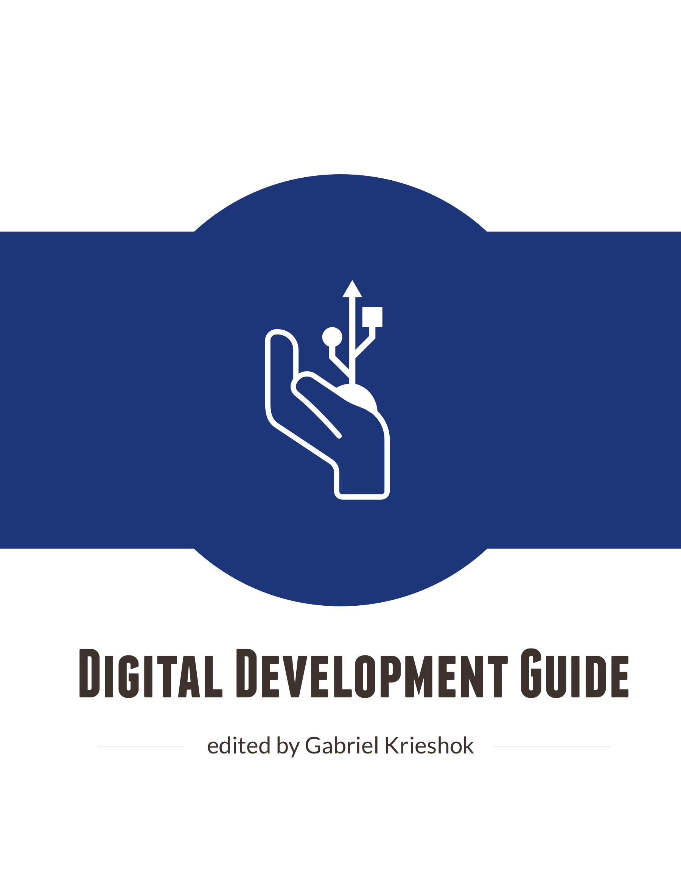

# The Digital Development Guide

—Edited by [Gabriel Krieshok](http://gabrielkrieshok.com)

---

Hi there.

This guide is being written to help people to use technology and data in order to bring about positive social change.

The information, resources, toolkits, and links provided are the result of many people's experiences working in the field—be it domestically in their country, or internationally around the world.

This is an open and ongoing effort, so please help us to develop its contents!

The content of the guide favors people who have some familiarity with Digital Development, ICT4D, and international development, but should be accessible and engaging to everyone.

This guide should not be considered as a comprehensive resource to those working in digital development. The value of this guide is that it is a concise and accessible resource to provide a reference of resources to get you started or moving along through a project.

The guide is divided into five parts.

## Part I. Basics

Part one broadly describes digital development, ICT4D, and using data for social good.

## Part II: Tools

Part two gives an overview of useful tools, technologies, and services of the trade for digital development workers.

## Part III: Topics

Part three identifies key focus area topics and associated helpful resources.

## Part IV: Learn

Part four helps get started to learn more about particular topics, tools, and approaches.

## Part V: Templates

Part five has documents you can use to get started with digital development in the field.

---

**Download a .pdf, .epub, or .mobi file from**:

* [https://www.gitbook.com/book/gabrielkrieshok/digital-development-guide/details](https://www.gitbook.com/book/gabrielkrieshok/digital-development-guide/details)

**Contribute content, suggestions, and fixes on github**:

* [https://github.com/gabrielkrieshok/digital-development-guide](https://github.com/gabrielkrieshok/digital-development-guide)

