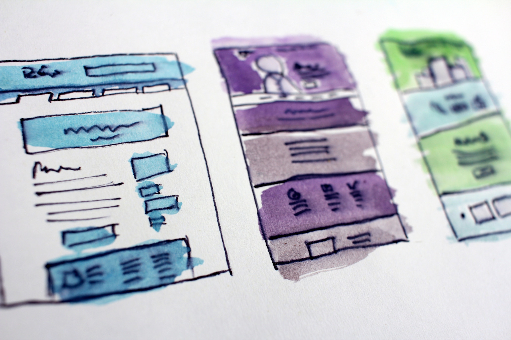

# ICT4D Sites

> "Once a new technology rolls over you, if you’re not part of the steamroller, you’re part of the road." — Stewart Brand

- [Alidade](https://alidade.tech/) — Interactive guide to choosing technology for your social change project. Their [offline manual](https://docs.google.com/document/d/1yRrQdx1hI7g75fgEPOO5Wve4Ed3L7G7Pws3_RBsf19c/) is great as well.

- [Digital Principles of Development](http://digitalprinciples.org/) — Guidelines that can help development practitioners integrate established best practices into technology-enabled program - written by and for international development donors, multilateral organizations, and implementing partners, and they are freely available for use by all.

- [Digital@DAI](https://dai-global-digital.com) — A relatively new but well-written blog covering recent technologies, experiments with tech solutions, and reviews.

- [FHI360's TechLab](https://www.fhi360.org/technology) — Unit within FHI360 that with develops tech and innovation strategies for FHI 360.

- [Global Innovation Exchange](http://www.globalinnovationexchange.com/) — Global portal for innovations, funding, insights, resources and conversations, built by USAID.

- [ICT Ethics](https://ictdethics.wordpress.com) — Analyzing, clustering and summarizing the ethical debates in ICTD.

- [ICT4D Conference](http://www.ict4dconference.org/) — Practitioner-oriented annual conference.

- [ICT4D Facebook Page](https://www.facebook.com/groups/2553350463/) — Nearly 5,000 members strong from academics to practitioners.

- [ICT4Drinks](http://ict4drinks.com/) — Semi-regular informal meetups mostly in DC.

- [ICTD Conference](http://ictd2017.itu.edu.pk/) — Academic-oriented annual conference.

- [ICTLogy](http://ictlogy.net/) — From [Ismael Peña-López](http://ictlogy.net/about-me/), one of the longest-running ICT sites and blogs. Many great links and resources.

- [Kopernik Impact Tracker](http://impacttrackertech.kopernik.info/) — Review of simple tools to collect data, communicate with clients, and measure impact. Targeting nonprofits and social enterprises.

- [London ICT4D Meetup](https://www.meetup.com/London-ICT4D/) — Monthly meetups in London.

- [Organizational Guide to ICT4D](http://solutionscenter.nethope.org/toolkit/view/organizational-guide-to-ict4d) — Guide to developing ICT4D capacity within organizations.

- [Research ICT Africa](http://www.researchictafrica.net/) — Run by [Alison Gillwald](http://www.researchictafrica.net/people.php) Regional ICT policy and regulation think tank active across Africa and the Global South.

- [Tech Salons](http://technologysalon.org/) — Regular meetings on technology topics in different cities.

- [United Methodist Communications - Best Practices in the use of ICTs](http://www.umcom.org/global-communications/using-technology-for-social-good) — Report from United Methodist Communications on ICT4D.

- [WSIS ICTD Projects Database](http://groups.itu.int/Default.aspx?tabid=788) — Database of ICT activities carried out by governments, international organizations, the business sector, civil society and others.