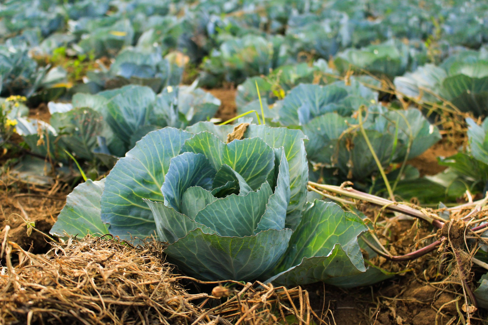

# Agriculture

- [WiderNet](http://widernet.org) — Promotes digital education and communications for all communities and individuals around the world, particularly through the support of their eGranary initiative.

- [Farm Radio International](http://www.farmradio.org) — Canadian charity working with more than 500 radio partners in 38 African countries to fight poverty and food insecurity.

- [Digital Green](https://www.digitalgreen.org) — Global development organization that empowers smallholder farmers to lift themselves out of poverty by harnessing the collective power of technology and grassroots-level partnerships.

- [Interactive Radio for Agricultural Development Projects](http://ictforag.org/toolkits/radio) — Radio toolkit for practitioners.

- [Social Media Handbook for Agricultural Development Practitioners.](http://ictforag.org/toolkits/social) — Social media toolkit in agriculture.

- [Integrating Low-cost Video into Agricultural Development Projects](http://ictforag.org/toolkits/video) — Video toolkit for agricultural practices.

- [Farmhack](http://farmhack.net) — Open-source community building appropriate technology solutions in farming.

- [CGIAR](https://www.cgiar.org) — Global research partnership for a food secure future dedicated to reducing poverty, enhancing food and nutrition security, and improving natural resources.
