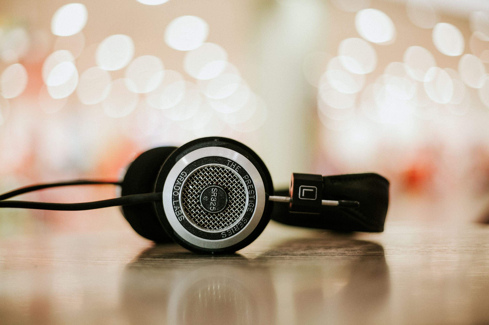

# Audio

- [Freesound.org](https://www.freesound.org) — Database of [Creative Commons](https://creativecommons.org)-licensed sounds.

- [Stock Music](https://www.pond5.com/royalty-free-music) — Royalty-free music.

- [Zencastr](https://zencastr.com) — In-browser podcasting.

- [Audio Library](https://www.youtube.com/audiolibrary/music) — Browse and download free music and sound effects.

- [Adobe Spark](https://spark.adobe.com) — Fast way to tell stories with graphics, text, videos, and animations.

- [PSDTUTS](https://design.tutsplus.com) — Free tutorials in design and illustration, 3D, motion graphics, photography, and audio.

- [Coffitivity](https://coffitivity.com) — Coffeeshop background sounds.

- [Noisli](https://www.noisli.com) — Background noise & color generator.

- [Audacity](https://audacityteam.org) — Free audio editor and recorder — great for all types of audio editing and production.

- [VLC Player](https://www.videolan.org/vlc) — Cross-platform multimedia player and framework that plays most multimedia files as well as DVDs, Audio CDs, VCDs, and various streaming protocols.
