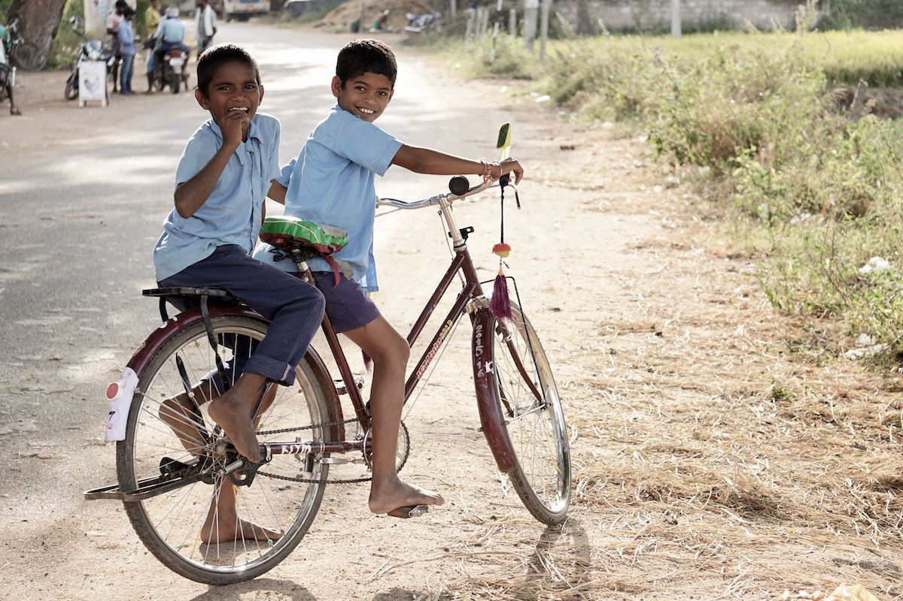

# Children

- [Kids On Computers](https://www.kidsoncomputers.org) — Nonprofit organization comprised of a group of volunteers, setting up computer labs in areas where kids don’t have access to technology.

- [eNACSO](http://enacso.eu) — NGO alliance aimed at creating a safer online environment for children through advocacy actions at national, European Union, and international levels.

- [End Child Pornography and Trafficking (ECPAT)](https://ecpat.org) — Protecting children from abduction, sexual abuse and exploitation, and listing of people, resources and tools needed to solve those problems.

- [Family Online Safety Institute (FOSI)](http://fosi.org) — International, nonprofit organization which works to make the online world safer for kids and their families.

- [ICMEC (International Center for Missing and Exploited Children)](https://icmec.org) — Global network dedicated to protecting children. They coordinate research, advocacy and action to end the commercial sexual exploitation of children.

- [Be Internet Awesome](https://beinternetawesome.withgoogle.com) — Helping kids be safe, confident explorers of the online world.

- [Comic Strips SeguraNet](http://seguranet.pt/en/comic-strips-seguranet) — Comic strips targeted at a younger audience to convey Internet safety issues.

- [Better Internet for Kids](https://www.betterinternetforkids.eu) — Core service platform to create a better internet for children and young people.

- [Sesame Workshop](http://sesameworkshop.org) — Nonprofit educational organization behind Sesame Street, their mission is to help kids grow smarter, stronger, and kinder.

- [ChildNet](http://childnet.com) — Nonprofit organization working with others to help make the internet a safe place for children.

- [Save the Children](https://savethechildren.org) — International non-governmental organization that promotes children's rights, provides relief and helps support children in developing countries.

- [UNICEF](http://unicef.org) — International organization that advocates for measures to give children the best start in life.

- [UNICEF Innovation Fund](https://www.unicefinnovationfund.org) — A newer funding source that may be of interest to communities.

- [Curiosity Machine](https://www.curiositymachine.org) — Science education non-profit offers flexible STEM education tool that can be adapted to any learning environment.
