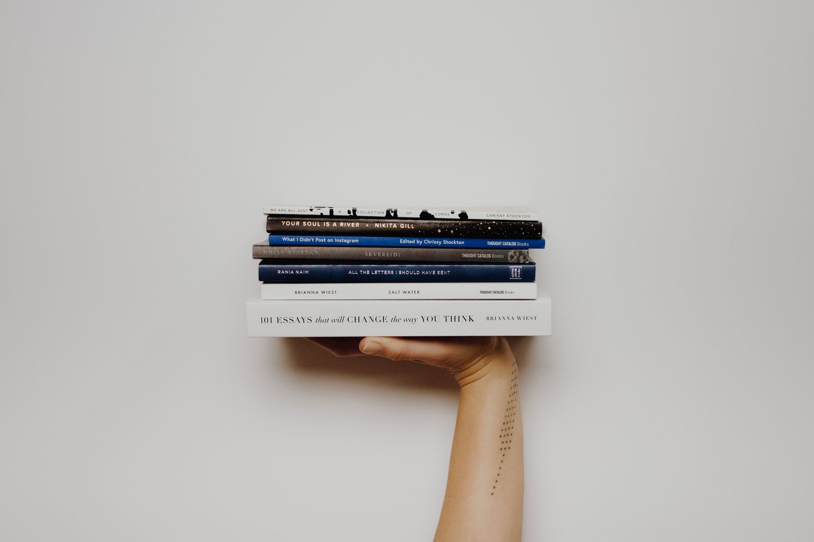

# Content

- [LibriVox](https://librivox.org) — Free public domain audiobooks.

- [Standard Ebooks](https://standardebooks.org) — Free ebooks, similar to the [Gutenberg collection](http://www.gutenberg.org), but that have been carefully edited and formatted.

- [Bartleby](https://bartleby.com) — Large collection of reference works, poetry, fiction, and nonfiction.

- [ICDL](http://en.childrenslibrary.org) — Open repository of digital texts aimed at children of a global context.

- [Internet Archive](https://archive.org) — Nonprofit library of millions of free books, movies, software, music, and more.

- [Open Culture](https://openculture.com) — Free cultural and educational media, including audio books, online courses, certificate courses/MOOCs, movies, eBooks, K-12 resources, and language lessons.

- [Open Library](https://openlibrary.org) — Classics of world literature.

- [Project Gutenberg](https://gutenberg.org) — Over 50,000 free eBooks in many formats available for download and online reading.

- [Sing Me a Story](https://singmeastory.org) — Open listing of songs to listen to for children around the world.

- [Textbook Revolution](http://textbookrevolution.org) — Student-run site that gives users access to free textbooks in subjects ranging from accounting to chemistry.

- [The Free Library](https://thefreelibrary.com) — The go-to place for access to newspapers, magazines, journal articles, and classic books.

- [TV411](http://tv411.org) — Engaging videos on reading and writing and sections on basic finance, science, and math.

- [Wikipedia Offline](https://akhenakh.github.io/gozim) — Server-side tool providing web pages to cheap clients.
