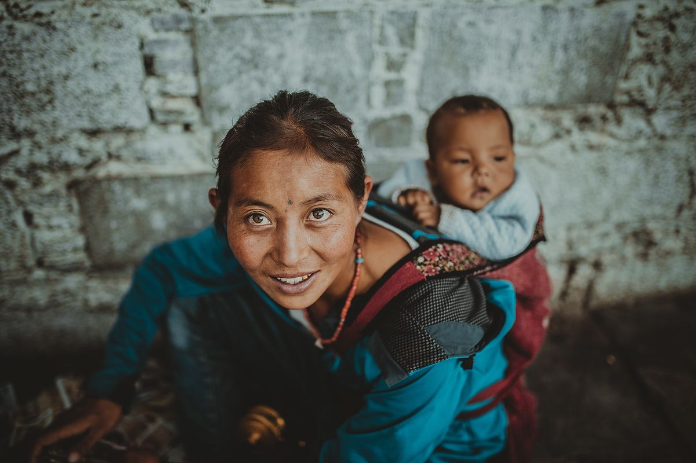

# Diversity

- [Code for Progress](http://www.codeforprogress.org) — Brings women and people of color into the coding workforce through holistic investment in their technical training and communities of support.

- [ELiTE Education](https://www.elite-education.org) — Organization that supports organizations around the world that inspire girls and underrepresented minorities with the power of computer science.

- [Grace Hopper](https://gracehopper.org) — World's largest gathering of women technologists.

- [Systers](https://anitaborg.org/get-involved/systers) — Forum for all women involved in the technical aspects of computing. The community has over 5,500 members from at least 60 countries around the world.
