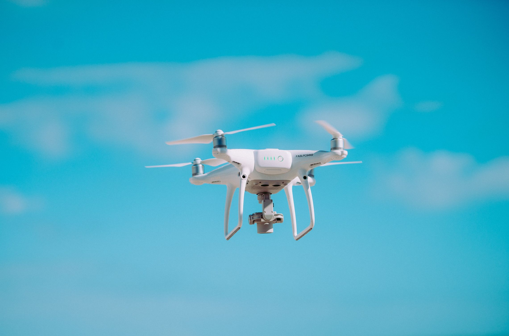

# Drones

- [Humanitarian UAV Code of Conduct](https://uavcode.org) — Informs the safe, responsible and effective use of civilian drones or Unmanned Aerial Vehicles (UAVs) in humanitarian settings.

- [Conservation Drones](https://conservationdrones.org) — Resources on building and flying drones, and their work in conversation contexts.

- [Global Drone Regulations Database](https://droneregulations.info) — Survey of laws and regulations affecting drone flights in countries around the world.
