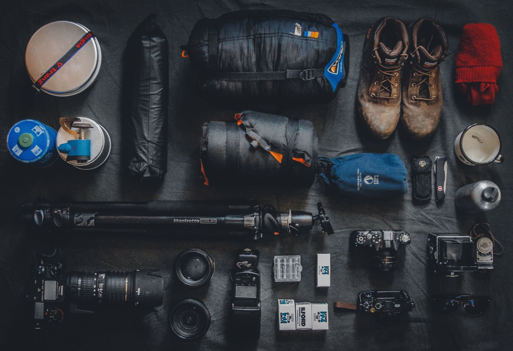

# Gear

- [BioLite Energy](https://www.bioliteenergy.com) — Innovative cookstoves that powers USB devices from traditional wood fuel.

- [Bluetooth Trackers](https://thewirecutter.com/reviews/best-bluetooth-tracker) — Portable devices that attach to objects to track them locally via Bluetooth connectivity.

- [BRCK](http://www.brck.org) — Innovative solution to combine a router, USB modem, SIM wireless modem, hard drive, and battery in one device.

- [DarkSucks](https://darksucks.com) — Great and rugged products including flashlights and pens, etc.

- [Goal Zero](https://www.goalzero.com) — Configurable solar chargers.

- [LibraryBox](http://librarybox.us) — Portable local server that offers up documents.

- [LudoBox](https://leschiensdelenfer.org/la-ludobox/ludobox-fr) — Portable local server built on the [LibraryBox](http://librarybox.us) concept.

- [Petzl](https://www.petzl.com) — Headlamp manufacturers.

- [Pirate Box](https://piratebox.cc) — Portable local server built on the [LibraryBox](http://librarybox.us).

- [RACHEL (Remote Area Community Hotspot for Education & Learning)](https://racheloffline.org) — Collection of tools and offline digital content curated for the Global South educational environment — versions use a Raspberry Pi computer or USB drive.

- [Rasbperry Pi](https://www.raspberrypi.org) — Small-board computer that provides a cheap and flexible alternative to full-spec desktop computers. Great for learning and experimental applications.

- [TouchTested](https://toughtested.com) — Solar charger for portable batteries and phones.

- [Gnarbox](https://www.gnarbox.com) — Backup hard drive device for use in the field (creates local WiFi network).
