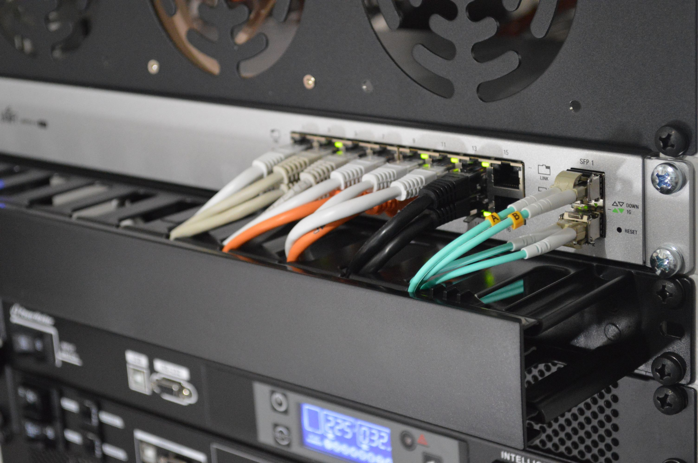

# Networks

- [VillageTelco](https://villagetelco.org) — Non-profit that builds low-cost community telephone network hardware and software.

- [OpenIDEO](https://openideo.com) — OpenIDEO (born out of [IDEO](https://www.ideo.com) and [IDEO.org](https://www.ideo.org), a design and innovation firm that uses a human-centered, collaborative approach to solving complex issues.

- [Comcast](https://github.com/tylertreat/comcast) — Simulating troublesome network connections so you can build better systems.

- [Hamms](https://github.com/kevinburke/hamms) — Elicit failures in your HTTP Client — connection failures, malformed response data, slow servers, fat headers, etc.

- [Loband](http://www.loband.org/loband) — Website that reduces webpages to the bare bones.

- [OpenBTS](http://openbts.org) — Open source software project for hardware-enabled mobile networks.

- [Right to Education Project](http://www.right-to-education.org) — Promote mobilization and accountability on the right to education and build bridges between the disciplines of human rights, education and development.

- [BRCK](http://www.brck.org) — Innovative solution to combine a router, USB modem, SIM wireless modem, hard drive, and battery in one device.

- [LibraryBox](http://librarybox.us) — Portable local server that offers up documents.

- [LudoBox](https://leschiensdelenfer.org/la-ludobox/ludobox-fr) — Portable local server built on the [LibraryBox](http://librarybox.us) concept.

- [Pirate Box](https://piratebox.cc) — Portable local server built on the [LibraryBox](http://librarybox.us).

- [RACHEL (Remote Area Community Hotspot for Education & Learning)](https://racheloffline.org) — Collection of tools and offline digital content curated for the Global South educational environment — versions use a Raspberry Pi computer or USB drive.

- [Wireless Network in Developing World](http://wndw.net) — Book about designing, implementing, and maintaining low-cost wireless networks.

- [HoRNDIS](https://joshuawise.com/horndis) — USB tethering driver for Androids to MacOS.

- [Humana](https://www.humana.org) — Network of 31 organizations engaged in international solidarity, cooperation and development in Europe, Africa, Asia and the Americas.

- [ISOC (Internet Society)](https://internetsociety.org) — Promotes the open development, evolution, and use of the Internet for the benefit of all people throughout the world.

- [mEducation Alliance](http://meducationalliance.org) — Consortium of private sector, government, donors, and program implementers working eliminate barriers to access appropriate, scalable, and low-cost mobile technologies to help improve learning outcomes in formal and non-formal education across all levels, especially in low-resource and developing country contexts.

- [National Peace Corps Association (NPCA)](http://peacecorpsconnect.org) — The nonprofit alumni organization of individuals who share the Peace Corps experience.

- [Humanitarian Innovation Organizations](https://www.google.com/maps/d/viewer?mid=1fxb_NuAPTkkSF-Xvo10jMWgBwOs) — Map of organizations working on humanitarian innovation projects—with descriptions and links.

- [International Network for Postgraduate Students in the area of ICT4D (IPID)](http://groupspaces.com/ipid) — Informal group with announcement about ICT4D-related news and opportunities aimed at higher education roles.

- [Mhealth Knowledge](http://mhealthknowledge.org) — Connecting global health professionals to people, products, and ideas.

- [WSIS Stocktaking](http://www.itu.int/net4/wsis/stocktakingp) — Database of ICT activities carried out by governments, international organizations, the business sector, civil society and others.

- [Humanitarian Makers](https://www.humanitarianmakers.org) — Makers, designers, and engineers using 'make' approaches for issues of social good.

- [Maker Map Resources](https://themakermap.com) — An ongoing open-source project which aims to create a global database of maker resources - from workspaces to incubators - which is powered by the maker community and easily searchable on any device.

- [Maker Share](https://makershare.com) — A community of makers sharing what they can do.

- [Makerspaces in Libraries](https://library-maker-culture.weebly.com/makerspaces-in-libraries.html) — Compendium of links and organizations working in the libraries and maker culture space.

- [Developing Radio Partners](https://www.developingradio.org) — US-based non-profit media development organization that works with local radio stations in developing countries, providing them with the skills they need to bring reliable information to those who need it most.

- [GLOBE (Global Learning and Observations to Benefit the Environment)](http://globe.gov) — International science and education program that provides students and the public worldwide with the opportunity to participate in data collection and the scientific process, and contribute meaningfully to our understanding of the Earth system and global environment.

- [Civicus](https://civicus.org/) — Global alliance of civil society organisations and activists dedicated to strengthening citizen action and civil society throughout the world. (NEW)

- [C4D Network](https://c4d.org/) — Global community of professionals working in Communication for Development. (NEW)

- [Humanitarian Innovation Fund](http://www.elrha.org/hif/) — Supports organisations and individuals to identify, nurture and share innovative and scalable solutions to the challenges facing effective humanitarian assistance. (NEW)