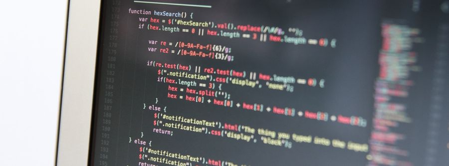

# Programming

- [Code for Progress](http://www.codeforprogress.org) — Brings women and people of color into the coding workforce through holistic investment in their technical training and communities of support.

- [Code Your Future](https://codeyourfuture.co) — Non-profit organization supporting refugees becoming developers.

- [YesWeCode](https://www.yeswecode.org) — Grassroots training programs and teaming up with major technology partners, celebrities and political leaders to promote the goal of training 100,000 low-opportunity youth to become high-level computer programmers.

- [Building for Billions](https://developers.google.com/web/billions) — Google portal for resources and information about building platforms for the less-connected parts of the world.

- [CodePen](https://codepen.io) — Front-end developer playground & code editor in the browser.

- [Coolors](https://coolors.co) — Generate infinite color palettes for your designs and share, export or save it in your profile.

- [Github](https://github.com) — Share code with friends, co-workers, classmates, and complete strangers.

- [Glitch](https://glitch.com) — Working example apps to remix, a code editor to modify them, instant hosting and deployment.

- [JSFiddle](https://jsfiddle.net) — Test code snippets of HTML, JavaScript, and CSS in-browser.

- [Scripting Language Cheatsheets](http://hyperpolyglot.org/scripting) — Side-by-side reference sheet for scripting languages.

- [Live EDU](https://www.liveedu.tv/livestreams) — Videos of real-time coding.

- [Beetle Blocks](http://beetleblocks.com) — Visual code for 3d design.

- [Bento](https://bento.io) — Learn to code and be a self-taught expert programmer.

- [Blockly](https://blockly-games.appspot.com) — Game-based programming.

- [Code Avengers](https://codeavengers.com) — A number of courses which include CSS3, JavaScript, and HTML5.

- [Code Combat](https://codecombat.com) — Learn coding by playing games.

- [Code Guide](http://codeguide.co) — Standards for developing flexible, durable, and sustainable HTML and CSS.

- [Code school](https://codeschool.com) — For the more advanced students. Includes iOS, HTML/CSS, JavaScript and Ruby.

- [Code.org](https://code.org) — Tons of online courses, challenges built around the Hour of Code — also available in 40+ languages.

- [Codecademy](https://www.codecademy.com) — Interactive code lessons — some of the best courses on the Internet here.

- [CodeHS](https://codehs.com) — Comprehensive teaching platform for helping schools teach computer science.

- [Computer Science Education](https://www.google.com/edu/cs/learn.html) — Google's paths of learning for students and educators.

- [Computer Science Unplugged](https://csunplugged.org) — Collection of free learning activities that teach computer science through engaging games and puzzles that use cards, string, crayons and lots of running around.

- [Crunchzilla](http://crunchzilla.com) — Interactive tutorials where kids and adults can play with code, experiment, build, and learn.

- [CS First](http://cs-first.com) — Free curriculum from [Google](https://www.google.com/about) that uses online, project-based tutorials for elementary and middle school students and offers free club plans and resources to create an easy computer science entry point for educators and students alike.

- [Development Documents](https://devdocs.io) — Development docs reference links for use in programming and code development.

- [Edhesive](https://edhesive.com) — Year-long computer science course.

- [Free Programming Books](https://github.com/vhf/free-programming-books) — Freely available programming books from a [Github](https://github.com/) repository.

- [Ray Wenderlich](https://www.raywenderlich.com) — Programming development tutorials — some of the best iOS training.

- [Learn X in Y Minutes](https://learnxinyminutes.com) — Community-driven tour of the most common computer programming languages.

- [Make School](https://www.makeschool.com) — Build and ship digital products school.

- [NETTUS](https://code.tutsplus.com) — Free tutorials in code, web design, and web development.

- [Pencil Code](https://pencilcode.net) — Real web real developing skills — starting with turtle graphics and moving on to HTML5, CSS, and jQuery. Create art, music, games, and stories in CoffeeScript and JavaScript using a unique switchable editor that lets you work in either blocks or text.

- [RoboMind Academy](https://robomindacademy.com) — Program to control a virtual robot to move, pick up, paint, etc. using text instructions.

- [Scratch](https://scratch.mit.edu) — Program your own interactive stories, games, and animations — and share your creations with others in the online community.

- [TechPrep](https://techprep.fb.com) — Introduction to the value of computer education and resources to get started if you're a student or mentor, from [Facebook](https://facebook.com).

- [The Beauty and Joy of Computing](https://bjc.berkeley.edu) — Year-long computer science principles course.

- [Thimble](https://thimble.mozilla.org) — This is an online code editor for learners & educators. It walks you through publishing your own web pages while learning HTML, CSS & JavaScript. It's part of the [Made with Code](https://www.madewithcode.com) effort from [Mozilla](https://mozilla.org).

- [Treehouse](https://teamtreehouse.com) — Learn development and design online.

- [W3Schools](https://w3schools.com) — Users can educate themselves on everything from HTML and CSS to JavaScript and SQL in web development.

- [Web Fundamentals](https://developers.google.com/web/fundamentals) — Google web fundamentals guide.

- [Good-Tutorials](http://good-tutorials.com) — Offers technology-focused tutorials curated from third-party sites on CSS, HTML, photography, Photoshop, and more.

- [BuiltByGirls](https://www.builtbygirls.com) — Organization with resources and challenges for young women to be builders, creators, and innovators.

- [Django Girls](https://djangogirls.org) — Free Python and Django workshops, create open sourced online tutorials and care about curating amazing first experiences with technology.

- [Technovation](https://technovationchallenge.org) — Annual challenge from that has girls all over the world compete to solve real-world problems through technology.

- [WiSci Girls STEAM Camp](https://girlup.org/wisci) — Part of the UN Foundation [Girl Up](https://girlup.org) campaign, WiSci Camp aims to help bridge that gap through access to education, mentorship opportunities and leadership training.

- [R](https://r-project.org) — Software programming language and software environment for statistical computing and graphics.

- [eSkills4Girls](https://www.eskills4girls.org) — Initiative from G20 members together with [UNESCO](https://en.unesco.org), [UN Women](http://www.unwomen.org), [ITU](https://www.itu.int) and [OECD](http://www.oecd.org) that aims at tackling the existing gender digital divide in particular in low income and developing countries.
