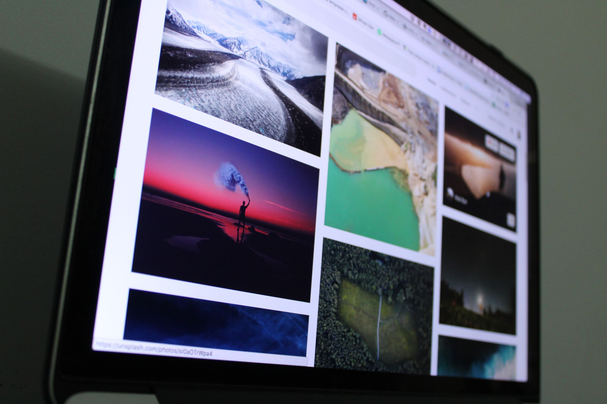

# Stock

- [BucketListly Photos](https://photos.bucketlistly.com) — Creative commons photos tagged by country.

- [Coverr](https://coverr.co) — Free stock videos for your homepage.

- [DesignersPics](http://www.designerspics.com) — Free high-res photos for use.

- [FreePhotos.cc](https://freephotos.cc) — Free stock and royalty-free images.

- [Freesound.org](https://www.freesound.org) — Database of [Creative Commons](https://creativecommons.org)-licensed sounds.

- [Gratisography](https://www.gratisography.com) — High-resolution photographs.

- [Mazwai](http://mazwai.com) — Free stock video snippets.

- [Pexels Photos](https://www.pexels.com) — Free stock photos - public domain and CC.

- [Pexels Videos](https://videos.pexels.com) — Free stock videos.

- [Pixeden](https://www.pixeden.com/free-graphics) — Free designer graphics.

- [Public Domain Images Archive](http://publicdomainarchive.com) — Free public domain stock photos.

- [Skuawk](http://skuawk.com) — Curated public domain photos.

- [Stock Music](https://www.pond5.com/royalty-free-music) — Royalty-free music.

- [Stock Up](https://www.sitebuilderreport.com/stock-up) — 15,000+ indexed photos from over 30 different stock photography sites.

- [Superfamous](https://images.superfamous.com) — Stock landscape photos with a CC license.

- [The Pattern Library](http://thepatternlibrary.com) — Free pattern images.

- [Unsplash](https://unsplash.com) — High-resolution photos.

- [Vastpic](http://vastpic.com) — Free high-res photos.

- [Videvo](https://www.videvo.net) — Free stock motion graphics and video.

- [Vimeo](https://vimeo.com/groups/freehd) — Free HD stock footage.

- [VisualHunt](https://visualhunt.com) — Free high-quality stock photos from many different sites.

- [Audio Library](https://www.youtube.com/audiolibrary/music) — Browse and download free music and sound effects.

- [Your Vector Maps](https://your-vector-maps.com) — Site with a bunch of links to vector-based maps and shapefiles of the whole Earth. Good for building things in Illustrator or Sketch or the web.
