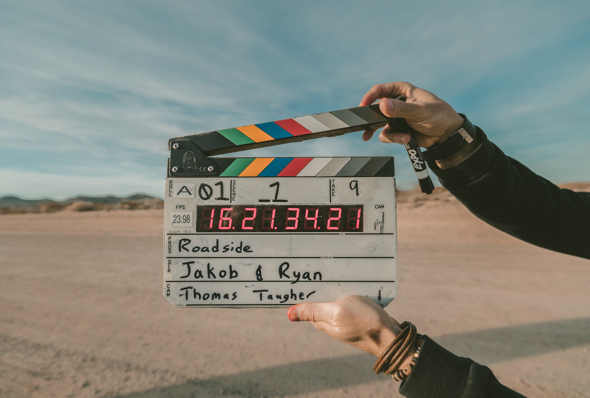

# Video

- [Live EDU](https://www.liveedu.tv/livestreams) — Videos of real-time coding.

- [Earth Journalism Network](https://earthjournalism.net) — Environmental journalism and storytelling — their [Resources Page](https://earthjournalism.net/resources) is really great.

- [Video4Change](https://v4c.org) — Video activists and those looking to use video for social change.

- [Witness](https://witness.org) — Video activists, trainers and their allies.

- [Coverr](https://coverr.co) — Free stock videos for your homepage.

- [Mazwai](http://mazwai.com) — Free stock video snippets.

- [Pexels Videos](https://videos.pexels.com) — Free stock videos.

- [Save From](https://en.savefrom.net) — Save videos from the Internet.

- [Videvo](https://www.videvo.net) — Free stock motion graphics and video.

- [Vimeo](https://vimeo.com/groups/freehd) — Free HD stock footage.

- [WeVideo](https://www.wevideo.com) — Online video editor for web, mobile, Windows & MacOS.

- [Audio Library](https://www.youtube.com/audiolibrary/music) — Browse and download free music and sound effects.

- [Adobe Spark](https://spark.adobe.com) — Fast way to tell stories with graphics, text, videos, and animations.

- [Ignite](http://igniteshow.com) — Series of speaking events in 100+ cities designed to have each person share something innovative or inspiring in just five minutes.

- [Small World News](https://smallworldnews.com/guides) — Supporting journalists and activists in under-served communities around the world tell compelling stories using mobile media tools and how to use them.

- [Visualising Information for Advocacy](https://visualisingadvocacy.org) — Website for a [book](https://visualisingadvocacy.org/getbook) about how advocates and activists use visual elements in their campaigns.

- [PSDTUTS](https://design.tutsplus.com) — Free tutorials in design and illustration, 3D, motion graphics, photography, and audio.

- [Lightworks](https://www.lwks.com) — Free video-editing for uploading to YouTube.

- [VLC Player](https://www.videolan.org/vlc) — Cross-platform multimedia player and framework that plays most multimedia files as well as DVDs, Audio CDs, VCDs, and various streaming protocols.

- [Integrating Low-cost Video into Agricultural Development Projects](http://ictforag.org/toolkits/video) — Video toolkit for agricultural practices.
