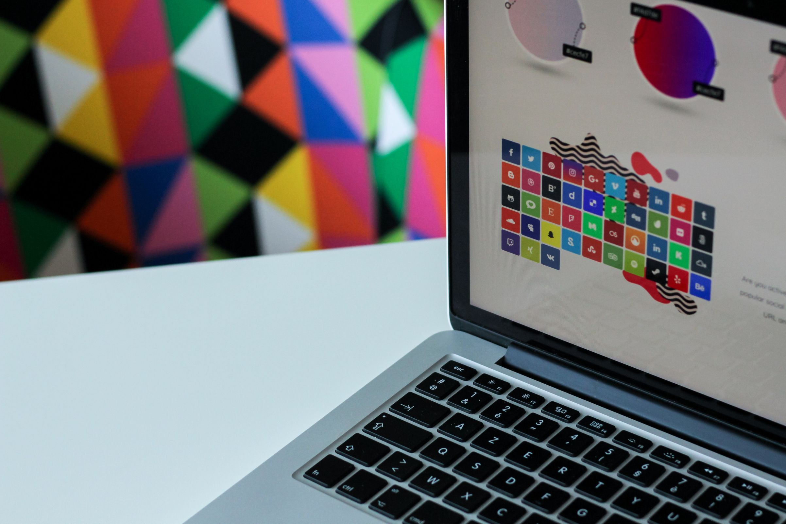

# Design

- [Invision](https://www.invisionapp.com) — Prototyping, collaboration & workflow platform.

- [Coolors](https://coolors.co) — Generate infinite color palettes for your designs and share, export or save it in your profile.

- [Beetle Blocks](http://beetleblocks.com) — Visual code for 3d design.

- [Design Language](https://www.ibm.com/design/language) — [IBM](https://www.ibm.com)'s shared vocabulary for design.

- [Vikalp Design](http://vikalpdesign.com) — Great project that designs cultural communication symbols.

- [Gist Deck](https://gistdeck.github.io) — Hosting Remark presentations on [Github](https://github.com) '[gists](https://gist.github.com)'.

- [impress.js](https://github.com/impress/impress.js) — Presentation framework based on the power of CSS3 transforms and transitions.

- [Placeit](https://placeit.net) — Free product mockups & templates.

- [Best Pitch Decks](https://pitchdeck.improvepresentation.com) — Good pitch deck resources and examples.

- [PSDTUTS](https://design.tutsplus.com) — Free tutorials in design and illustration, 3D, motion graphics, photography, and audio.

- [GIMP](https://www.gimp.org) — GNU Image Manipulation Program. Graphics software for photo retouching, image composition and image authoring.

- [Inkscape](https://inkscape.org/en) — Open-source scalable vector graphics editor (similar to [Adobe Illustrator](https://www.adobe.com/products/illustrator.html)).

- [Microsoft Inclusive Design](https://microsoft.com/en-us/design/inclusive) — Microsoft's very good center that has a lot of great resources for designing with inclusion in mind from the beginning.
