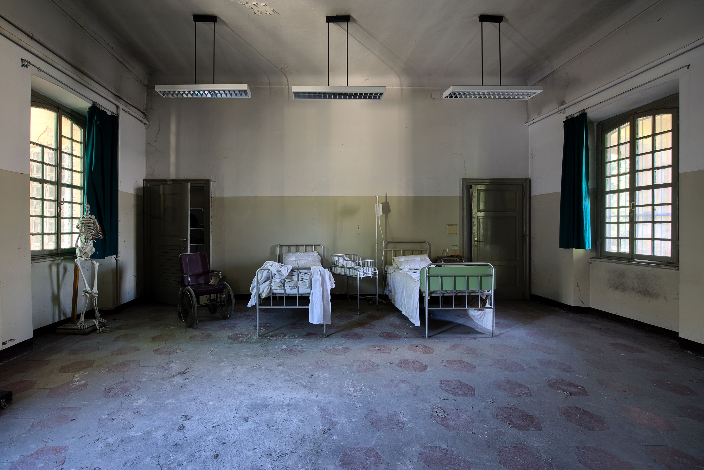

# Health

- [EDC](https://edc.org) — Private organization that designs, implements, and evaluates programs to improve education, health, and economic opportunity worldwide.

- [Red Cross First Aid](https://www.redcross.org/mobile-apps/first-aid-app) — Useful for emergencies, but also once you get to site this app may be a helpful educational tool to share or use for a health club. For iOS and Android.

- [D-Rev](https://d-rev.org) — D-Rev is a non-profit specifically dedicated to designing products for development. Their portfolio includes projects focused on malaria, tuberculosis, milk pasteurization, and agriculture.

- [Mhealth Knowledge](http://mhealthknowledge.org) — Connecting global health professionals to people, products, and ideas.

- [Demographic and Health Surveys](https://dhsprogram.com) — Analyzes and distributes survey results regarding health, nutrition, HIV for over 75 countries.

- [HealthMap](https://healthmap.org/en) — Real-time intelligence on a broad range of emerging infectious diseases for a diverse audience including libraries, local health departments, governments, and international travelers.

- [Malaria Atlas Project](https://map.ox.ac.uk) — Disseminates free, accurate and up-to-date information on malaria and associated topics, organized on a geographical basis.

- [Jhpiego](https://www.jhpiego.org) — International, non-profit health organization affiliated with [Johns Hopkins University](https://www.jhu.edu).

- [mPoweringHealth](http://mpoweringhealth.org) — Partnership of private sector, government, donors, and program implementers working to accelerate the use of mobile technology to improve the skills and performance of frontline health workers.

- [Knowledge 4 Health](https://www.k4health.org) — Knowledge and tools to strengthen family planning and other public health efforts worldwide.

- [Healthsites.io](https://healthsites.io) — Canonical location for data and the tools necessary to upload, manage and make data around healthcare disease or disaster outbreak easily accessible.

- [Global Digital Health Network](https://www.globaldigitalhealthnetwork.org) — Formerly the mHealth Working Group, created in 2009 by global health organizations for global health organizations, is a 3000+ person-strong networking forum for members from 108 countries to share information, engage with the broader community, and provide leadership in digital health for global public health.

- [Digital Health Atlas](https://digitalhealthatlas.org) — [WHO](http://www.who.int) toolkit for measuring and facilitating scale-up and national institutionalization of digital health solutions.
