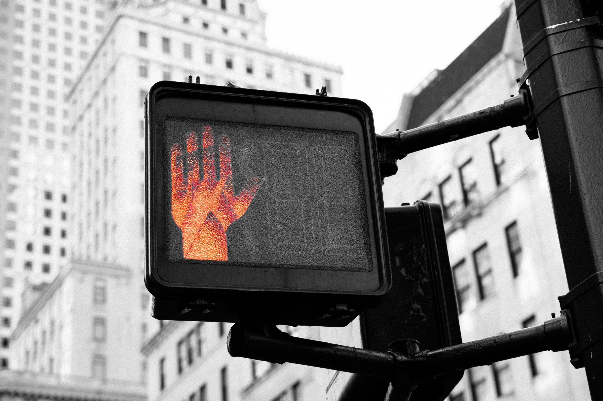

# Internet Safety

- [Your Social Media Fingerprint](https://robinlinus.github.io/socialmedia-leak) — Detect which platforms you're currently signed into.

- [WebWise](https://www.webwise.ie) — Safe Internet resources for teachers and parents from the EU.

- [eNACSO](http://enacso.eu) — NGO alliance aimed at creating a safer online environment for children through advocacy actions at national, European Union, and international levels.

- [End Child Pornography and Trafficking (ECPAT)](https://ecpat.org) — Protecting children from abduction, sexual abuse and exploitation, and listing of people, resources and tools needed to solve those problems.

- [Family Online Safety Institute (FOSI)](http://fosi.org) — International, nonprofit organization which works to make the online world safer for kids and their families.

- [ICMEC (International Center for Missing and Exploited Children)](https://icmec.org) — Global network dedicated to protecting children. They coordinate research, advocacy and action to end the commercial sexual exploitation of children.

- [Comic Strips SeguraNet](http://seguranet.pt/en/comic-strips-seguranet) — Comic strips targeted at a younger audience to convey Internet safety issues.

- [Better Internet for Kids](https://www.betterinternetforkids.eu) — Core service platform to create a better internet for children and young people.

- [Mozilla Learning Network](https://learning.mozilla.org) — Lessons and platforms from Mozilla on everything from basic and advanced digital literacy, privacy, programming, and more — also has some incredible online and offline teaching activities.

- [ChildNet](http://childnet.com) — Nonprofit organization working with others to help make the internet a safe place for children.

- [HarassMap](https://harassmap.org) — Ending the social acceptability of sexual harassment and assault in Egypt — it's an SMS-to-web solution which allows women to anonymously report sexual harassment they face in Egypt by sending a simple text that is then displayed on a public map on the website.
