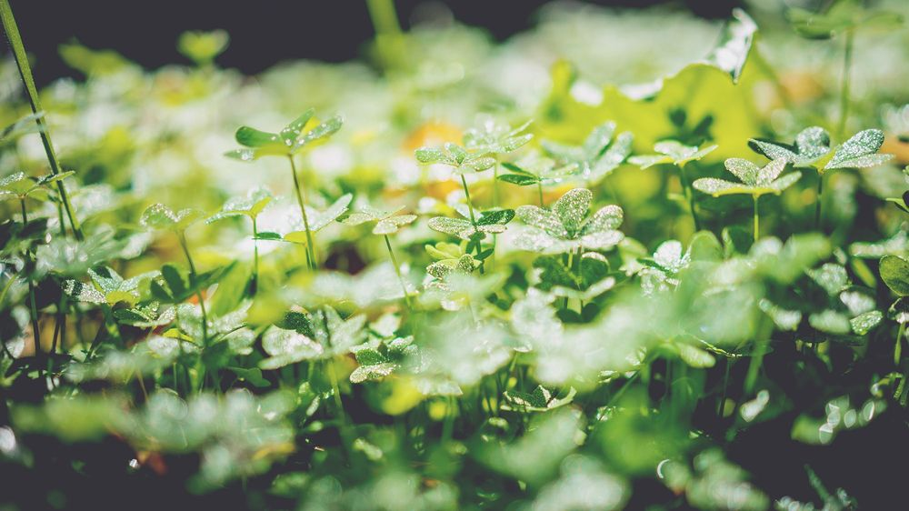

# Environment

- [National Geographic](http://nationalgeographic.com) — Nonprofit scientific and educational institution that focuses on geography, archaeology, natural science, and the promotion of environmental and historical conservation.

- [WRI](https://wri.org) — Non-governmental global research organization which seeks to create equity and prosperity through sustainable natural resource management.

- [Exploring the Environment](http://ete.cet.edu/modules/modules.html) — Problem-based learning approach to studying climate change and weather. Students will use data from [NASA](https://www.nasa.gov/) and various climate science data sets to study different aspects of global warming.

- [Museum of Science + Industry Chicago](https://msichicago.org/online-science) — Series of games, apps, videos, and activities that teach science in an interactive, easily accessible way.

- [National Geographic Kids](https://kids.nationalgeographic.com) — Many resources on different kinds of animals and their environments.

- [Power Up](https://powerup.ukpowernetworks.co.uk/powerup/en/under-11) — Information about how electricity works, where it comes from, and, most importantly, how to stay safe. There are fun, interactive games where kids can build their own circuits, trace how electricity travels to homes, and take quizzes to test their knowledge.

- [Weather Wiz Kids](http://weatherwizkids.com) — Explore the fascinating world of weather. It has explanations of many different weather phenomena, and a large variety of games, jokes, and quizzes about weather.

- [Climate Change and African Political Stability Map](http://ccaps.aiddata.org/climate) — Comparing climate change to political stability with an [ESRI](https://esri.com) map (complete with controls and sliders).

- [GESCI (Global E-Schools and Communities Initiative)](http://gesci.org) — International NGO and works with developing country governments and agencies in Africa, Asia, and Latin America to leverage technology as a catalyst for improving access and quality of education.

- [OpenForis](http://openforis.org) — Free open-source solutions for environmental monitoring.

- [Conservation Drones](https://conservationdrones.org) — Resources on building and flying drones, and their work in conversation contexts.
