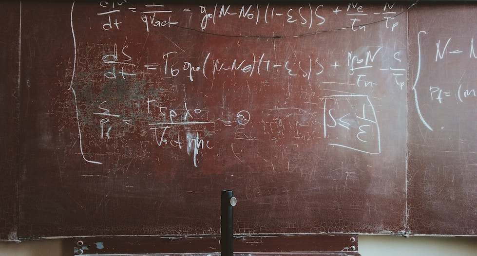

# STEM

- [Exploring the Environment](http://ete.cet.edu/modules/modules.html) — Problem-based learning approach to studying climate change and weather. Students will use data from [NASA](https://www.nasa.gov/) and various climate science data sets to study different aspects of global warming.

- [Museum of Science + Industry Chicago](https://msichicago.org/online-science) — Series of games, apps, videos, and activities that teach science in an interactive, easily accessible way.

- [National Geographic Kids](https://kids.nationalgeographic.com) — Many resources on different kinds of animals and their environments.

- [Power Up](https://powerup.ukpowernetworks.co.uk/powerup/en/under-11) — Information about how electricity works, where it comes from, and, most importantly, how to stay safe. There are fun, interactive games where kids can build their own circuits, trace how electricity travels to homes, and take quizzes to test their knowledge.

- [Weather Wiz Kids](http://weatherwizkids.com) — Explore the fascinating world of weather. It has explanations of many different weather phenomena, and a large variety of games, jokes, and quizzes about weather.

- [Girls Make Games](http://girlsmakegames.com) — Series of international summer camps, workshops and game jams designed to inspire the next generation of designers, creators, and engineers.

- [Girls Who Code](https://girlswhocode.com) — Programs work to inspire, educate, and equip girls with the computing skills to pursue 21st century opportunities.

- [Million Women Mentors](https://www.millionwomenmentors.org) — Supports the engagement of one million Science, Technology, Engineering and Math (STEM) mentors (male and female) to increase the interest and confidence of girls and women to persist and succeed in STEM programs and careers.

- [WiSci Girls STEAM Camp](https://girlup.org/wisci) — Part of the UN Foundation [Girl Up](https://girlup.org) campaign, WiSci Camp aims to help bridge that gap through access to education, mentorship opportunities and leadership training.

- [Project Euler](https://projecteuler.net) — Challenging mathematical/computer programming problems.

- [Curiosity Machine](https://www.curiositymachine.org) — Science education non-profit offers flexible STEM education tool that can be adapted to any learning environment.

- [GESCI (Global E-Schools and Communities Initiative)](http://gesci.org) — International NGO and works with developing country governments and agencies in Africa, Asia, and Latin America to leverage technology as a catalyst for improving access and quality of education.

- [GLOBE (Global Learning and Observations to Benefit the Environment)](http://globe.gov) — International science and education program that provides students and the public worldwide with the opportunity to participate in data collection and the scientific process, and contribute meaningfully to our understanding of the Earth system and global environment.

- [Iridescent](https://iridescentlearning.org) — Education non-profit that trains professional engineers, scientists, and parents to deliver cutting-edge STEM education to underserved girls, children and their families through two flagship programs: [Technovation](https://technovationchallenge.org) and [Curiosity Machine](https://www.curiositymachine.org).

- [NASA](https://nasa.gov) — US space agency – has a wealth of resources in education, particularly in STEM.

- [Smithsonian Education](http://www.smithsonianeducation.org/educators) — Over 2,000 resources for educators and teachers to use.

- [ABCya](https://abcya.com) — A wide variety of activities, lessons, and games for students to learn about many different concepts in math and language arts.

- [APlusMath](http://aplusmath.com) — Provides interactive math activities to help students improve their math skills.

- [BBC BiteSize Science](https://bbc.co.uk/education) — Learning and revision resources, learner guides for primary and secondary students, and class clips (videos for teachers to use in the classroom).

- [Smithsonian Curriculum & Resources](https://ssec.si.edu/explore-our-curriculum-resources) — Videos, games, resources, ebooks, curriculum, and apps. Be sure to check the "free resources only" filter.

- [DIY.org](https://diy.org) — Online community for kids to focused on building skills and STEM-related activities.

- [Explore Smithsonian](https://ssec.si.edu/explore-smithsonian) — From the [Smithsonian Science Education Center](https://ssec.si.edu), dedicated to formal pre-K-12 science education reform.

- [Good Thinking](https://ssec.si.edu/goodthinking) — Animated series that helps teachers teach science.

- [HowToSmile](https://howtosmile.org) — Over 3,500 science and math activities — search and filter by age, material costs, and learning time.

- [IBM Activity Kits](https://ibm.com/ibm/responsibility/initiatives/activitykits) — Kits aimed at helping not-for-profit organizations understand their technology needs, sharing the fun of math and science with school children.

- [IXL](https://ixl.com) — List of key math skills that students should learn in different grades. For each concept, they provide practice questions that become harder as you correctly answer them.

- [Kidport](http://kidport.com) — Many offers lots of "think-and-learn" math activities for grades K-8

- [PBS Kids](https://pbskids.org/games/engineering) — Many engineering games that allow students to solve mysteries with Curious George, build robots, and create their own engineering challenges to solve.

- [Science Kids](http://sciencekids.co.nz) — Contains many different resources for students to learn about the various concepts of engineering. There are fun project ideas, quizzes, experiments, and videos to engage kids.

- [Sheppard Software](https://sheppardsoftware.com) — Hundreds of free, online, educational games for kids.

- [Smithsonian Learning Lab](https://learninglab.si.edu) — Digital resources from across the Smithsonian's 19 museums, 9 major research centers, the National Zoo, and more, can be used together, for learning.

- [Teaching Engineering](https://teachengineering.org) — Searchable, web-based digital library collection populated with standards-based engineering curricula for use by K-12 teachers and engineering faculty to make applied science and math come alive through engineering design in K-12 settings.

- [Web Adventures](http://webadventures.rice.edu) — Six interactive adventures in science where you will help solve a problem.
